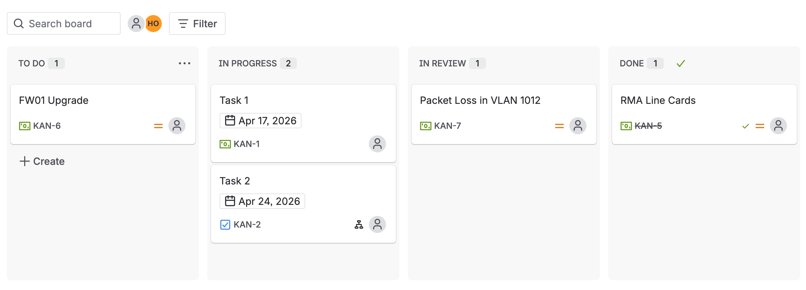

```{=html}
<style>
figcaption { text-align: center; }
</style>
```

## Overview

Every network design decision ultimately traces back to the business it serves. Understanding what a business needs, why it needs it, and what success looks like is the foundation of any effective design. This chapter examines the business elements that sit at the top of the design hierarchy and explores how each one cascades down to influence network decisions at the lower layers.

## Business Success

The best place to start understanding the business needs and requirements is to look at the big picture of a company or business and understand its associated business priorities, business drivers, and business outcomes. This enables network designers to
steer the design to ensure business success. As outlined in @fig-top-down-approach, with a [top-down design approach](network-design.qmd), it is almost always the requirements, constraints, and drivers at higher layers, such as business and application requirements, that drive and set the requirements and directions for the lower layers. 


::: {#fig-top-down-approach}
```{=html}
<div style="text-align:center">
    <svg xmlns="http://www.w3.org/2000/svg" style="max-width:150%;max-height:481px;" xmlns:xlink="http://www.w3.org/1999/xlink" version="1.1" width="676px" viewBox="-0.5 -0.5 451 321"><defs/><g><g data-cell-id="0"><g data-cell-id="1"><g data-cell-id="wMGaYJPsTA5tUn50LOM--7"><g transform="translate(0.5,0.5)"><rect x="0" y="95" width="380" height="45" rx="6.75" ry="6.75" fill="#dae8fc" stroke="#6c8ebf" pointer-events="all" style="fill: light-dark(rgb(218, 232, 252), rgb(29, 41, 59)); stroke: light-dark(rgb(108, 142, 191), rgb(92, 121, 163));"/></g><g><g fill="#000000" font-family="Garamond" font-weight="bold" text-anchor="start" font-size="12px" style="fill: light-dark(rgb(0, 0, 0), rgb(255, 255, 255));"><text x="2" y="122.5">Business</text></g></g></g><g data-cell-id="wMGaYJPsTA5tUn50LOM--8"><g transform="translate(0.5,0.5)"><path d="M 166.18 -126.46 L 211.48 62.36 L 166.18 251.18 Z" fill="#e1d5e7" stroke="#9673a6" stroke-miterlimit="10" transform="rotate(-90,188.83,62.36)" pointer-events="all" style="fill: light-dark(rgb(225, 213, 231), rgb(57, 47, 63)); stroke: light-dark(rgb(150, 115, 166), rgb(149, 119, 163));"/></g></g><g data-cell-id="qvsvWrgy21NAlNbeDwcb-1"><g transform="translate(0.5,0.5)"><rect x="130" y="0" width="120" height="30" rx="4.5" ry="4.5" fill="#ffffff" stroke="#000000" pointer-events="all" style="fill: light-dark(#ffffff, var(--ge-dark-color, #121212)); stroke: light-dark(rgb(0, 0, 0), rgb(255, 255, 255));"/></g><g><g fill="#000000" font-family="Garamond" font-weight="bold" text-anchor="middle" font-size="13px" style="fill: light-dark(rgb(0, 0, 0), rgb(255, 255, 255));"><text x="190" y="20.5">Business Success</text></g></g></g><g data-cell-id="qvsvWrgy21NAlNbeDwcb-2"><g transform="translate(0.5,0.5)"><rect x="295.63" y="107.5" width="71.25" height="20" fill="#ffffff" stroke="#000000" pointer-events="all" style="fill: light-dark(#ffffff, var(--ge-dark-color, #121212)); stroke: light-dark(rgb(0, 0, 0), rgb(255, 255, 255));"/></g><g><g fill="#000000" font-family="Garamond" text-anchor="middle" font-size="12px" style="fill: light-dark(rgb(0, 0, 0), rgb(255, 255, 255));"><text x="331.26" y="122.5">Requirements</text></g></g></g><g data-cell-id="qvsvWrgy21NAlNbeDwcb-3"><g transform="translate(0.5,0.5)"><rect x="215.63" y="107.5" width="71.25" height="20" fill="#ffffff" stroke="#000000" pointer-events="all" style="fill: light-dark(#ffffff, var(--ge-dark-color, #121212)); stroke: light-dark(rgb(0, 0, 0), rgb(255, 255, 255));"/></g><g><g fill="#000000" font-family="Garamond" text-anchor="middle" font-size="12px" style="fill: light-dark(rgb(0, 0, 0), rgb(255, 255, 255));"><text x="251.26" y="122.5">Outcomes</text></g></g></g><g data-cell-id="qvsvWrgy21NAlNbeDwcb-4"><g transform="translate(0.5,0.5)"><rect x="135.63" y="107.5" width="71.25" height="20" fill="#ffffff" stroke="#000000" pointer-events="all" style="fill: light-dark(#ffffff, var(--ge-dark-color, #121212)); stroke: light-dark(rgb(0, 0, 0), rgb(255, 255, 255));"/></g><g><g fill="#000000" font-family="Garamond" text-anchor="middle" font-size="12px" style="fill: light-dark(rgb(0, 0, 0), rgb(255, 255, 255));"><text x="171.26" y="122.5">Drivers</text></g></g></g><g data-cell-id="qvsvWrgy21NAlNbeDwcb-5"><g transform="translate(0.5,0.5)"><rect x="54.38" y="107.5" width="71.25" height="20" fill="#ffffff" stroke="#000000" pointer-events="all" style="fill: light-dark(#ffffff, var(--ge-dark-color, #121212)); stroke: light-dark(rgb(0, 0, 0), rgb(255, 255, 255));"/></g><g><g fill="#000000" font-family="Garamond" text-anchor="middle" font-size="12px" style="fill: light-dark(rgb(0, 0, 0), rgb(255, 255, 255));"><text x="90" y="122.5">Priorities</text></g></g></g><g data-cell-id="qvsvWrgy21NAlNbeDwcb-6"><g transform="translate(0.5,0.5)"><rect x="0" y="150" width="70" height="40" rx="6" ry="6" fill="#d5e8d4" stroke="#82b366" pointer-events="all" style="fill: light-dark(rgb(213, 232, 212), rgb(31, 47, 30)); stroke: light-dark(rgb(130, 179, 102), rgb(68, 110, 44));"/></g><g><g fill="#000000" font-family="Garamond" text-anchor="middle" font-size="12px" style="fill: light-dark(rgb(0, 0, 0), rgb(255, 255, 255));"><text x="35" y="168">Business</text><text x="35" y="182">Continuity</text></g></g></g><g data-cell-id="qvsvWrgy21NAlNbeDwcb-7"><g transform="translate(0.5,0.5)"><rect x="310" y="150" width="70" height="40" rx="6" ry="6" fill="#d5e8d4" stroke="#82b366" pointer-events="all" style="fill: light-dark(rgb(213, 232, 212), rgb(31, 47, 30)); stroke: light-dark(rgb(130, 179, 102), rgb(68, 110, 44));"/></g><g><g fill="#000000" font-family="Garamond" text-anchor="middle" font-size="12px" style="fill: light-dark(rgb(0, 0, 0), rgb(255, 255, 255));"><text x="345" y="175">More ...</text></g></g></g><g data-cell-id="qvsvWrgy21NAlNbeDwcb-8"><g transform="translate(0.5,0.5)"><rect x="225.63" y="150" width="74.37" height="40" rx="6" ry="6" fill="#d5e8d4" stroke="#82b366" pointer-events="all" style="fill: light-dark(rgb(213, 232, 212), rgb(31, 47, 30)); stroke: light-dark(rgb(130, 179, 102), rgb(68, 110, 44));"/></g><g><g fill="#000000" font-family="Garamond" text-anchor="middle" font-size="12px" style="fill: light-dark(rgb(0, 0, 0), rgb(255, 255, 255));"><text x="262.82" y="175">Innovation</text></g></g></g><g data-cell-id="qvsvWrgy21NAlNbeDwcb-9"><g transform="translate(0.5,0.5)"><rect x="80" y="150" width="135.63" height="40" rx="6" ry="6" fill="#d5e8d4" stroke="#82b366" pointer-events="all" style="fill: light-dark(rgb(213, 232, 212), rgb(31, 47, 30)); stroke: light-dark(rgb(130, 179, 102), rgb(68, 110, 44));"/></g><g><g fill="#000000" font-family="Garamond" text-anchor="middle" font-size="12px" style="fill: light-dark(rgb(0, 0, 0), rgb(255, 255, 255));"><text x="147.82" y="168">Business Trends Merger</text><text x="147.82" y="182">Acquisition, Divest</text></g></g></g><g data-cell-id="qvsvWrgy21NAlNbeDwcb-10"><g transform="translate(0.5,0.5)"><rect x="0" y="200" width="380" height="30" rx="4.5" ry="4.5" fill="#fff2cc" stroke="#d6b656" pointer-events="all" style="fill: light-dark(rgb(255, 242, 204), rgb(40, 29, 0)); stroke: light-dark(rgb(214, 182, 86), rgb(109, 81, 0));"/></g><g><g fill="#000000" font-family="Garamond" text-anchor="middle" font-size="12px" style="fill: light-dark(rgb(0, 0, 0), rgb(255, 255, 255));"><text x="190" y="220">Business Applications</text></g></g></g><g data-cell-id="qvsvWrgy21NAlNbeDwcb-11"><g transform="translate(0.5,0.5)"><rect x="0" y="240" width="380" height="30" rx="4.5" ry="4.5" fill="#ffe6cc" stroke="#d79b00" pointer-events="all" style="fill: light-dark(rgb(255, 230, 204), rgb(54, 33, 10)); stroke: light-dark(rgb(215, 155, 0), rgb(153, 101, 0));"/></g><g><g fill="#000000" font-family="Garamond" text-anchor="middle" font-size="12px" style="fill: light-dark(rgb(0, 0, 0), rgb(255, 255, 255));"><text x="190" y="260">Technical and Functional Requirements</text></g></g></g><g data-cell-id="qvsvWrgy21NAlNbeDwcb-12"><g transform="translate(0.5,0.5)"><rect x="0" y="280" width="380" height="40" rx="6" ry="6" fill="#f8cecc" stroke="#b85450" pointer-events="all" style="fill: light-dark(rgb(248, 206, 204), rgb(81, 45, 43)); stroke: light-dark(rgb(184, 84, 80), rgb(215, 129, 126));"/></g><g><g fill="#000000" font-family="Garamond" text-anchor="middle" font-size="12px" style="fill: light-dark(rgb(0, 0, 0), rgb(255, 255, 255));"><text x="190" y="298">Network Infrastructure Solutions</text><text x="190" y="312">Routing, Switching, Mobility, Security</text></g></g></g><g data-cell-id="qvsvWrgy21NAlNbeDwcb-13"><g transform="translate(0.5,0.5)"><path d="M 410 40.5 L 430 40.5 L 430 295.5 L 444.1 295.5 L 420 319.5 L 395.9 295.5 L 410 295.5 Z" fill="#f9f7ed" stroke="#36393d" stroke-miterlimit="10" pointer-events="all" style="fill: light-dark(rgb(249, 247, 237), rgb(27, 25, 17)); stroke: light-dark(rgb(54, 57, 61), rgb(186, 189, 192));"/></g></g><g data-cell-id="qvsvWrgy21NAlNbeDwcb-14"><g transform="translate(0.5,0.5)"><rect x="390" y="10" width="60" height="30" fill="none" stroke="none" pointer-events="all"/></g><g><g fill="#000000" font-family="Garamond" text-anchor="middle" font-size="12px" style="fill: light-dark(rgb(0, 0, 0), rgb(255, 255, 255));"><text x="420" y="30">Top-Down</text></g></g></g></g></g></g></svg>
</div>
```

Business Success Top-Down Approach
:::

### Business Priorities

Each business has a set of business priorities that are [typically based on strategies adopted for the achievement of goals. Network designers must be aware of these business priorities to align them with the design priorities, which ensures the success of the network they are designing by delivering business value.

For example, suppose a company's highest priority is to provide a more collaborative and interactive business communications solution, followed by the provision of mobile access for end users. In this case, the collaborative communications solution must be satisfied first before extending it over any mobility solution. It is important to align the design with the business priorities, which are key to achieving business success and transforming IT into a business enabler.

An example business priority would be security. There are a number of terms used for this priority, such as Zero Trust Architecture](network-design.qmd#pervasive-security), cybersecurity modernization, and risk management framework, but the intent is the same: secure the network and maintain data integrity. If a business's data is compromised, that business is out of business.

### Business Drivers

[A business driver is usually the reason a business must achieve a specific outcome. It is the "why" the business is doing something. Business drivers are what organizations must follow: the constraints and challenges that apply to the business.

::: {.callout-note}
The word "constraints" here refers to the three constraint categories defined in Network Design](network-design.qmd#constraints): business constraints, application constraints, and technology constraints. A compliance requirement like HIPAA is a **business constraint** because it is a hard rule imposed on the organization from the outside.
:::

An example of a business driver would be a constraint to follow a specific compliance standard like HIPAA or PCI DSS. This aligns with the business priority of security. If the business does not adhere to this constraint, depending on the compliance standard in question, the business can be fined or even shut down. For this example, the business driver could be worded as: *"Required to follow HIPAA compliance standards."*

### Business Outcomes

[A business outcome equates to the end result, such as saving money, diversifying the business, increasing revenue, or filling a specific need. Essentially, a business outcome is an underlying goal a business is trying to achieve, and it will specifically map to a business driver.

Returning to the security example:

- Business priority: Security
- Business driver: "Required to follow HIPAA compliance standards"
- Business outcome: "Properly maintain HIPAA compliance to stay in business"

At a minimum, there will be one outcome per driver, but there can be multiple outcomes mapping to the same driver. This is perfectly fine. If, and when, an organization achieves its business outcomes, then its business drivers are met, which ensures the organization's business success.

### Business Capabilities

Before going down the "solutionizing" path, which most engineers tend to do too early, it is important to understand what business capabilities are and how they apply to network design. Business capabilities are not solutions. Business capabilities are what you get from a solution. Most solutions provide multiple capabilities. Some solutions provide parts of multiple capabilities, and when combined with other solutions, the business can obtain a number of capabilities that will make them successful.

Session-based security is a great example of a capability that a business might need to meet compliance standards. A vendor-agnostic solution that provides this capability would be a network access control (NAC) solution. There are many different vendor-specific NAC solutions, but all of them, regardless of vendor, provide the capability of session-based security. Cisco Identity Services Engine (ISE) is an example of a vendor-specific solution that provides the capability of session-based security, and it actually provides multiple capabilities beyond session-based security.

Business capabilities map directly to business outcomes. Multiple capabilities often map to the same outcome, and multiple outcomes often map to the same capability. This is expected and perfectly fine. Table below shows the relationship between business priorities, drivers, outcomes, and capabilities.

::: {.callout-note}
When capabilities are translated into design work, they become the requirements the network must satisfy. Those requirements fall into the three types defined in Network Design](network-design.qmd#requirements): [functional requirements](network-design.qmd#functional-requirements-behavioral-requirements) (what the system must do), [nonfunctional requirements](network-design.qmd#nonfunctional-requirements-technical-requirements) (security, availability, integration), and [application requirements](network-design.qmd#application-requirements) (quality of experience for end users).
:::

| Priority | Driver | Outcome | Capabilities |
|:--|:--|:--|:--|
| Priority 1 | Driver 1 | Outcome 1 | Capability 1, Capability 2 |
| Priority 1 | Driver 2 | Outcome 2 | Capability 1 |
| Priority 2 | Driver 3 | Outcome 2 | Capability 1 |
| Priority 3 | Driver 3 | Outcome 3 | Capability 3, Capability 4 |
| Priority 4 | Driver 4 | Outcome 4 | Capability 4 |

: Business Priorities, Drivers, Outcomes, and Capabilities Relationship Mapping (Example) {tbl-colwidths="[20,20,20,40]"}

::: {.callout-note}
## How to Read This Table

Think of each row as a story that flows left to right:

**Priority** (what the business wants) → **Driver** (the reason it must act) → **Outcome** (the result it is after) → **Capabilities** (what a solution delivers to get there)

A few things to notice in the table:

- The same driver can appear under different priorities (Driver 3 maps to both Priority 2 and Priority 3), meaning one constraint can push multiple parts of the business at once.
- The same outcome can be reached from different drivers (Outcome 2 appears in two rows), meaning there can be more than one reason to pursue the same goal.
- The same capability can satisfy multiple outcomes (Capability 1 appears in three rows), meaning one technical solution can deliver value across several business goals at the same time.

The key distinction that trips most people up is outcome vs. capability. The outcome is what the business wants to achieve. The capability is what a technical solution actually delivers. You do not buy a capability directly; you buy a solution that gives you capabilities, and those capabilities are what enable the outcomes.
:::

### Business Continuity

[Business continuity (BC) refers to the ability to continue business activities following an outage, which might result from a system failure or a natural disaster such as a fire that damages a data center. Businesses therefore need a mechanism or approach to build and improve the level of resiliency to react to and recover from unplanned outages.

The level of resiliency is not necessarily required to be the same across the entire network, because the drivers of BC for different parts of the network can vary based on different levels of impact on the business. These business drivers may include compliance with regulations or the level of criticality to the business in case of any system or site connectivity outage.

For instance, if a retail business has an outage in one of its remote stores, this is of less concern than an outage to the primary data center. If the primary data center were to go offline for a certain period of time, this would affect all other stores (higher risk) and could cost the business a larger loss in terms of money (tangible) and reputation (intangible). Therefore, the resiliency of the data center network is of greater consideration for this retailer than the resiliency of remote sites.

Similarly, the location of the outage sometimes influences the level of criticality and design consideration. An outage at a small store in a remote area might not be as critical as an outage in a large store in a major city. BC considerations based on risk assessment and its impact on the business can be considered one of the primary drivers for many businesses to adopt network technologies and design principles to meet their desired goals.

#### Recovery Point Objective

The amount of data that can be lost during an outage at peak business demand before harm occurs to the business is called the recovery point objective (RPO). The harm to the business can be monetary or reputation based. In other words, RPO focuses on the amount of data loss acceptable to the business.

RPO is expressed as a time value and is calculated as the gap between the last successful backup and the moment the failure occurred:

$$RPO = T_{failure} - T_{last\_backup}$$

Where $T_{failure}$ is the time the outage started and $T_{last\_backup}$ is the time of the most recent successful backup. The result represents the maximum window of data that could be lost.

For example, if a server fails at 2:00 AM and the last successful backup completed at 9:00 PM the previous day, the data loss window is:

$$RPO = 2{:}00\text{ AM} - 9{:}00\text{ PM} = 5\text{ hours of data loss}$$

If the business has defined an RPO of 6 hours, this scenario is within tolerance. If the RPO were 4 hours, it would not be — meaning the backup frequency must increase to close the gap.

The amount of data that can be lost from an RPO perspective is given a specific time value, measured against the last backup that took place. In most cases the RPO is less than an hour, with the average value being 10 minutes. This means a company with an RPO of 10 minutes must ensure backups occur at least every 10 minutes, so that no more than 10 minutes of data can ever be lost in a failure scenario.

Different organizations will have different RPO tolerances. A bank dealing with customer transactions may tolerate near-zero data loss, while an online retailer may tolerate a few minutes since orders can potentially be recreated through other means.

#### Recovery Time Objective

The length of time an application, system, network, or resource can be offline without causing significant business damage, as well as the time it takes to restore the service, is called the recovery time objective (RTO). The RTO is focused on the time to recover from a failing system or network outage.

RTO is calculated as the time between the moment of failure and the moment the system is fully restored:

$$RTO = T_{restored} - T_{failure}$$

Where $T_{restored}$ is the time the system is back in service and $T_{failure}$ is the time the outage began. The result must be less than or equal to the business-defined RTO threshold.

For example, if a system fails at 2:00 AM and is restored by 2:45 AM:

$$RTO = 2{:}45\text{ AM} - 2{:}00\text{ AM} = 45\text{ minutes}$$

If the business has defined an RTO of 1 hour, this is within tolerance. If the RTO were 30 minutes, the recovery would have exceeded the threshold and caused business harm.

Returning to the cloud-based infrastructure company example, suppose it had a critical outage for 10 minutes that affected all online access. The company has an RPO of 15 minutes and an RTO of 20 minutes, so the company was within both metrics. Later that week, the company had another outage that lasted 2 hours during peak business demand. With the RPO only allowing for 15 minutes of data loss and the RTO only allowing 20 minutes of downtime, 1 hour and 40 minutes of the outage was not accounted for. This example shows that the loss of data was exponential, as it occurred during peak business demand.

::: {.callout-note}
RPO and RTO are inversely related to cost. A shorter RPO requires more frequent backups and faster storage, and a shorter RTO requires more redundancy and faster recovery infrastructure. Both drive up cost significantly. Business leaders must be involved in defining these values because the decision is ultimately a trade-off between risk tolerance and investment.
:::

### Review Questions {.unnumbered}

**1. Which business term has the definition "typically based on strategies adopted for the achievement of goals"?**

a. Capability
b. Outcome
c. Driver
d. Priority

::: {.callout-tip collapse="true"}
## Answer
**d.** Each business has a set of priorities that are typically based on strategies adopted for the achievement of goals. These business priorities can influence the planning and design of IT network infrastructure. Therefore, network designers must be aware of these business priorities to align them with the design priorities, which ensures the success of the network they are designing by delivering business value.
:::

---

**2. Which business term is referenced as the "why" the business is doing something?**

a. Capability
b. Outcome
c. Driver
d. Priority

::: {.callout-tip collapse="true"}
## Answer
**c.** What does this business have to do and why? This is what we call a business driver. Business drivers are what organizations must follow. A business driver is usually the reason a business must achieve a specific outcome. It is the "why" the business is doing something. Being required to maintain a specific compliance standard is a perfect example.
:::

---

**3. Which business term equates to the end result, such as saving money, diversifying the business, increasing revenue, or filling a specific need?**

a. Capability
b. Outcome
c. Driver
d. Priority

::: {.callout-tip collapse="true"}
## Answer
**b.** A business outcome equates to the end result, such as saving money, diversifying the business, increasing revenue, or filling a specific need. Essentially, a business outcome is an underlying goal a business is trying to achieve. A business outcome will specifically map to a business driver.
:::

---

**4. Which business term refers to what a solution provides, and most times you get multiple of them?**

a. Capability
b. Outcome
c. Driver
d. Priority

::: {.callout-tip collapse="true"}
## Answer
**a.** Business capabilities are not solutions. Business capabilities are what you get from a solution. A network access control solution provides a business the session- and transaction-based security capability, for example. Most solutions provide multiple capabilities. Some solutions provide parts of multiple capabilities, and when they are combined with other solutions, the business can get a number of capabilities that will make it successful.
:::

---

**5. An architect receives a business requirement from a CTO that states the RTO and RPO for a new system should be as close as possible to zero. Which replication method and data center technology should be used?**

a. Asynchronous replication over dual data centers via DWDM
b. Synchronous replication over geographically dispersed dual data centers via MPLS
c. Synchronous replication over dual data centers via Metro Ethernet
d. Asynchronous replication over geographically dispersed dual data centers via CWDM

::: {.callout-tip collapse="true"}
## Answer
**c.** When both RTO and RPO must be as close to zero as possible, synchronous replication is required to ensure no data loss. Metro Ethernet provides high-speed, low-latency connectivity between geographically close data centers, minimizing the latency impact that would otherwise make synchronous replication impractical.
:::

---

**6. Company XYZ is planning to deploy primary and secondary disaster recovery data center sites 100 miles apart. Target RPO and RTO are 3 hours and 24 hours respectively. Which two considerations must the company bear in mind when deploying replication? (Choose two.)**

a. Target RPO/RTO requirements cannot be met due to the one-way delay introduced by the distance between sites
b. VSANs must be routed between sites to isolate fault domains and increase overall availability
c. Synchronous data replication must be used to meet the business requirements
d. Asynchronous data replication should be used in this scenario to avoid performance impact on the primary site
e. VSANs must be extended from the primary to the secondary site to improve performance and availability

::: {.callout-tip collapse="true"}
## Answer
**b and c.** VSANs must be routed between sites to isolate fault domains, which increases availability. With an RPO of 3 hours, synchronous replication is appropriate and achievable at 100 miles distance. Asynchronous replication would introduce data loss risk beyond the RPO target.
:::

---

**7. In the case of outsourced IT services, the RTO is defined within the SLA. Which two support terms are often included in the SLA by IT and other service providers? (Choose two.)**

a. Resolution time
b. Network reliability
c. Network size and cost
d. Network sustainability
e. Support availability

::: {.callout-tip collapse="true"}
## Answer
**a and e.** Resolution time defines how long it takes to resolve an incident, and support availability defines when support can be reached. These are the two most common SLA terms alongside RTO. Network reliability, size, cost, and sustainability are not standard SLA support terms.
:::

---

**8. An architect receives a business requirement stating the RTO for a new system should be 4 hours and the RPO should be less than 1 hour. Business continuity must also be ensured in the event of a natural disaster. Which replication method and data center technology should be used?**

a. Asynchronous replication over dual data centers via DWDM
b. Asynchronous replication over geographically dispersed dual data centers via CWDM
c. Synchronous replication over dual data centers via Metro Ethernet
d. Synchronous replication over geographically dispersed dual data centers via MPLS

::: {.callout-tip collapse="true"}
## Answer
**d.** Natural disaster protection requires geographically dispersed data centers. An RPO of less than 1 hour requires synchronous replication to minimize data loss. MPLS provides the reliable, low-latency WAN connectivity needed to support synchronous replication over distance.
:::

---

**9. A company requires an RPO of less than 10 seconds to ensure business continuity. Which technology should be deployed?**

a. A single data center with duplicated infrastructure, dual PSUs, and a UPS
b. Geographically dispersed data centers with asynchronous replication
c. Geographically dispersed data centers with synchronous replication
d. A single data center with duplicated infrastructure and dual PSUs

::: {.callout-tip collapse="true"}
## Answer
**c.** An RPO of less than 10 seconds means virtually no data loss is tolerable. Only synchronous replication guarantees that data is written to both sites simultaneously before the write is acknowledged. Asynchronous replication introduces a lag that would exceed a 10-second RPO. Geographic dispersion also ensures protection against site-level disasters.
:::

---

**10. Which two factors must be considered when calculating the RTO? (Choose two.)**

a. Importance and priority of individual systems
b. Steps needed to mitigate or recover from a disaster
c. Cost of lost data and operations
d. How often backups are taken and how quickly these can be restored
e. Maximum tolerable amount of data loss that the organization can sustain

::: {.callout-tip collapse="true"}
## Answer
**a and b.** RTO is about how quickly systems must be restored. The importance and priority of individual systems determines the order of recovery, and the steps needed to recover define how long that recovery takes. Options d and e relate to RPO, not RTO, since they concern data loss rather than recovery time.
:::

---

**11. Data replication is being designed as part of a data protection setup. Which replication strategy is best suited when the primary and secondary systems are physically close to each other?**

a. Synchronous replication
b. Snapshot replication
c. Transactional replication
d. Direct replication

::: {.callout-tip collapse="true"}
## Answer
**a.** Synchronous replication is best suited when systems are physically close because the low latency between sites makes it practical to wait for the remote write acknowledgment before confirming the local write. This guarantees zero data loss. Snapshot and transactional replication introduce data loss windows and are better suited for distant or asynchronous scenarios.
:::

---

**12. Backups and mirror-copies of data are an essential part of RPO solutions. If a business wants to reduce their CAPEX for disaster recovery, which solution is applicable?**

a. Perform an annual cybersecurity assessment or penetration test
b. Renew backup software annually to stay protected
c. Migrate parts of or all the infrastructure to the cloud
d. Build a redundant infrastructure for business continuity at another location

::: {.callout-tip collapse="true"}
## Answer
**c.** Migrating infrastructure to the cloud reduces CAPEX for disaster recovery by replacing owned hardware with pay-as-you-go cloud resources. Building a redundant physical site increases CAPEX. Annual assessments and software renewals are OPEX items and do not address the CAPEX reduction goal.
:::

---

**13. For a company that offers online billing systems, which strategy ensures the RPO is kept as low as possible?**

a. Cloud backup to mirror data
b. Spare onsite disks
c. Periodic snapshot of data
d. Backup on external storage

::: {.callout-tip collapse="true"}
## Answer
**a.** Cloud backup that continuously mirrors data keeps the RPO as close to zero as possible because data is replicated in near real time. Periodic snapshots, spare disks, and external storage all introduce a time gap between the last backup and a potential failure, increasing the RPO.
:::

### Elasticity to Support Strategic Business Trends

Elasticity refers to the level of flexibility a certain design can provide in response to business changes. A change in this context refers to the direction the business is heading, which can take different forms such as organic business growth, a decline in business, a merger, or an acquisition.

To illustrate the concept of elasticity in network design, consider the higher education campus architecture from Network Design](network-design.qmd). This architecture has four locations interconnected directly, as illustrated in @fig-campus-direct. Any organic growth that requires the addition of a new location will introduce significant complexity in terms of cabling, control plane, and manageability. These complexities result from an inflexible design that is incapable of responding to the business's natural growth demand.

::: {#fig-campus-direct}
```{=html}
<div style="text-align:center">
        <svg xmlns="http://www.w3.org/2000/svg" style="max-width:100%;max-height:669px;" xmlns:xlink="http://www.w3.org/1999/xlink" version="1.1" width="653px" viewBox="-0.5 -0.5 653 669"><defs/><g><g data-cell-id="7TL0YMLbxa03PcHlFPwQ-0"><g data-cell-id="7TL0YMLbxa03PcHlFPwQ-1"><g data-cell-id="VAJTU0AaTEecpy79CADM-3"><g transform="translate(0.5,0.5)"><rect x="35" y="477.5" width="580" height="190" rx="7.6" ry="7.6" fill="#d5e8d4" stroke="#82b366" pointer-events="all" style="fill: light-dark(rgb(213, 232, 212), rgb(31, 47, 30)); stroke: light-dark(rgb(130, 179, 102), rgb(68, 110, 44));"/></g></g><g data-cell-id="VAJTU0AaTEecpy79CADM-2"><g transform="translate(0.5,0.5)"><rect x="461.25" y="280" width="190" height="180" rx="7.2" ry="7.2" fill="#fff2cc" stroke="#d6b656" pointer-events="all" style="fill: light-dark(rgb(255, 242, 204), rgb(40, 29, 0)); stroke: light-dark(rgb(214, 182, 86), rgb(109, 81, 0));"/></g></g><g data-cell-id="VAJTU0AaTEecpy79CADM-1"><g transform="translate(0.5,0.5)"><rect x="0" y="280" width="190" height="180" rx="7.2" ry="7.2" fill="#ffe6cc" stroke="#d79b00" pointer-events="all" style="fill: light-dark(rgb(255, 230, 204), rgb(54, 33, 10)); stroke: light-dark(rgb(215, 155, 0), rgb(153, 101, 0));"/></g></g><g data-cell-id="VAJTU0AaTEecpy79CADM-0"><g transform="translate(0.5,0.5)"><rect x="210" y="0" width="230" height="315" rx="9.2" ry="9.2" fill="#f8cecc" stroke="#b85450" pointer-events="all" style="fill: light-dark(rgb(248, 206, 204), rgb(81, 45, 43)); stroke: light-dark(rgb(184, 84, 80), rgb(215, 129, 126));"/></g></g><g data-cell-id="7TL0YMLbxa03PcHlFPwQ-3"><g transform="translate(0.5,0.5)"><path d="M 263.8 152.56 L 263.8 172.6 L 263.8 160 L 263.8 180" fill="none" stroke="#000000" stroke-miterlimit="10" pointer-events="stroke" style="stroke: light-dark(rgb(0, 0, 0), rgb(255, 255, 255));"/></g></g><g data-cell-id="7TL0YMLbxa03PcHlFPwQ-4"><g><rect x="228.75" y="105" width="70" height="47.56" fill="none" stroke="none" pointer-events="all"/><path d="M 298.75 118.8 C 298.75 126.4 283.14 132.58 263.74 132.58 C 244.36 132.58 228.75 126.4 228.75 118.8 C 228.75 138.78 228.75 138.78 228.75 138.78 C 228.75 146.38 244.36 152.56 263.74 152.56 C 283.14 152.56 298.75 146.38 298.75 138.78 Z M 263.74 132.58 C 283.14 132.58 298.75 126.4 298.75 118.8 C 298.75 111.18 283.14 105 263.74 105 C 244.36 105 228.75 111.18 228.75 118.8 C 228.75 126.4 244.36 132.58 263.74 132.58 Z" fill="#036897" stroke="#ffffff" stroke-width="2" stroke-linejoin="round" stroke-miterlimit="10" pointer-events="all" style="fill: light-dark(rgb(3, 104, 151), rgb(92, 179, 220)); stroke: light-dark(rgb(255, 255, 255), rgb(18, 18, 18));"/><path d="M 255.71 113.56 L 258.55 117.84 L 247.67 120.23 L 250.04 118.31 L 233.48 115.46 L 237.73 112.13 L 253.81 114.99 Z M 271.32 124.02 L 268.95 119.74 L 278.88 117.37 L 277.46 119.27 L 293.54 122.12 L 289.77 124.98 L 273.21 122.12 Z M 265.64 111.18 L 276.51 108.32 L 277 112.61 L 274.16 112.13 L 268.95 116.89 L 263.74 115.94 L 268.95 111.66 Z M 260.9 128.3 L 250.5 130.21 L 250.04 124.98 L 253.34 125.93 L 259.02 120.7 L 264.23 121.65 L 258.07 127.36 Z" fill="#ffffff" stroke="none" pointer-events="all" style="fill: light-dark(rgb(255, 255, 255), rgb(18, 18, 18));"/></g></g><g data-cell-id="7TL0YMLbxa03PcHlFPwQ-5"><g transform="translate(0.5,0.5)"><path d="M 263.8 250 L 263.8 270 L 263.8 255 L 263.8 275" fill="none" stroke="#000000" stroke-miterlimit="10" pointer-events="stroke" style="stroke: light-dark(rgb(0, 0, 0), rgb(255, 255, 255));"/></g></g><g data-cell-id="7TL0YMLbxa03PcHlFPwQ-6"><g><rect x="246.25" y="180" width="35" height="70" fill="none" stroke="none" pointer-events="all"/><path d="M 246.25 250 L 246.25 192.04 L 266.25 192.04 L 266.25 250 Z M 266.25 192.04 L 246.25 192.04 L 264.38 180 L 281.25 180 Z M 281.25 180 L 281.25 235.24 L 266.25 250 L 266.25 192.04 Z" fill="#036897" stroke="#ffffff" stroke-width="2" stroke-linejoin="round" stroke-miterlimit="10" pointer-events="all" style="fill: light-dark(rgb(3, 104, 151), rgb(92, 179, 220)); stroke: light-dark(rgb(255, 255, 255), rgb(18, 18, 18));"/><path d="M 276.86 192.58 L 276.86 183.28 M 276.86 211.73 L 276.86 202.43 M 276.86 230.31 L 276.86 221.01 M 281.25 225.93 L 266.25 240.7 M 281.25 216.65 L 266.25 230.86 M 281.25 207.35 L 266.25 221.01 M 281.25 198.05 L 266.25 211.73 M 281.25 189.3 L 266.25 201.88 M 266.25 192.04 L 281.25 180 M 266.25 240.7 L 246.25 240.7 M 266.25 230.86 L 246.25 230.86 M 266.25 221.01 L 246.25 221.01 M 266.25 211.17 L 246.25 211.17 M 266.25 201.88 L 246.25 201.88 M 271.88 244.52 L 271.88 235.24 M 271.88 225.93 L 271.88 216.65 M 271.88 206.81 L 271.88 197.5" fill="none" stroke="#ffffff" stroke-width="2" stroke-linejoin="round" stroke-miterlimit="10" pointer-events="all" style="stroke: light-dark(rgb(255, 255, 255), rgb(18, 18, 18));"/></g></g><g data-cell-id="7TL0YMLbxa03PcHlFPwQ-7"><g transform="translate(0.5,0.5)"><path d="M 298.75 292.5 L 349.25 292.5" fill="none" stroke="#000000" stroke-miterlimit="10" pointer-events="stroke" style="stroke: light-dark(rgb(0, 0, 0), rgb(255, 255, 255));"/></g></g><g data-cell-id="7TL0YMLbxa03PcHlFPwQ-8"><g transform="translate(0.5,0.5)"><path d="M 263.75 310 L 263.75 485" fill="none" stroke="#000000" stroke-miterlimit="10" pointer-events="stroke" style="stroke: light-dark(rgb(0, 0, 0), rgb(255, 255, 255));"/></g></g><g data-cell-id="7TL0YMLbxa03PcHlFPwQ-9"><g transform="translate(0.5,0.5)"><path d="M 296.68 310 L 481.2 408.05" fill="none" stroke="#000000" stroke-miterlimit="10" pointer-events="stroke" style="stroke: light-dark(rgb(0, 0, 0), rgb(255, 255, 255));"/></g></g><g data-cell-id="7TL0YMLbxa03PcHlFPwQ-10"><g><rect x="228.75" y="275" width="70" height="35" fill="none" stroke="none" pointer-events="all"/><path d="M 281.52 310 L 281.52 292.31 L 228.75 292.31 L 228.75 310 Z M 228.75 292.31 L 250 275 L 298.75 275 L 281.16 292.31 Z M 281.52 310 L 298.75 290.84 L 298.75 275 L 281.52 292.31 Z" fill="#036897" stroke="#ffffff" stroke-width="2" stroke-linejoin="round" stroke-miterlimit="10" pointer-events="all" style="fill: light-dark(rgb(3, 104, 151), rgb(92, 179, 220)); stroke: light-dark(rgb(255, 255, 255), rgb(18, 18, 18));"/><rect x="228.75" y="275" width="0" height="0" fill="none" stroke="#ffffff" stroke-width="2" pointer-events="all" style="stroke: light-dark(rgb(255, 255, 255), rgb(18, 18, 18));"/><path d="M 259.53 287.89 L 258.43 288.63 L 245.6 288.63 L 244.14 290.1 L 240.48 288.63 L 247.8 286.42 L 246.34 287.89 Z M 269.79 281.26 L 268.69 282.36 L 255.87 282.36 L 254.4 283.47 L 250.74 282 L 258.07 280.15 L 256.6 281.26 Z M 261.73 285.68 L 262.83 284.95 L 276.03 284.95 L 277.12 283.47 L 280.79 284.95 L 273.83 287.16 L 274.93 285.68 Z M 268.69 279.05 L 269.79 278.32 L 282.62 278.32 L 284.08 276.84 L 287.76 278.68 L 280.42 280.53 L 281.88 279.05 Z" fill="#ffffff" stroke="none" pointer-events="all" style="fill: light-dark(rgb(255, 255, 255), rgb(18, 18, 18));"/></g></g><g data-cell-id="7TL0YMLbxa03PcHlFPwQ-11"><g><rect x="366.75" y="180" width="35" height="70" fill="none" stroke="none" pointer-events="all"/><path d="M 366.75 250 L 366.75 192.04 L 386.75 192.04 L 386.75 250 Z M 386.75 192.04 L 366.75 192.04 L 384.88 180 L 401.75 180 Z M 401.75 180 L 401.75 235.24 L 386.75 250 L 386.75 192.04 Z" fill="#036897" stroke="#ffffff" stroke-width="2" stroke-linejoin="round" stroke-miterlimit="10" pointer-events="all" style="fill: light-dark(rgb(3, 104, 151), rgb(92, 179, 220)); stroke: light-dark(rgb(255, 255, 255), rgb(18, 18, 18));"/><path d="M 397.36 192.58 L 397.36 183.28 M 397.36 211.73 L 397.36 202.43 M 397.36 230.31 L 397.36 221.01 M 401.75 225.93 L 386.75 240.7 M 401.75 216.65 L 386.75 230.86 M 401.75 207.35 L 386.75 221.01 M 401.75 198.05 L 386.75 211.73 M 401.75 189.3 L 386.75 201.88 M 386.75 192.04 L 401.75 180 M 386.75 240.7 L 366.75 240.7 M 386.75 230.86 L 366.75 230.86 M 386.75 221.01 L 366.75 221.01 M 386.75 211.17 L 366.75 211.17 M 386.75 201.88 L 366.75 201.88 M 392.38 244.52 L 392.38 235.24 M 392.38 225.93 L 392.38 216.65 M 392.38 206.81 L 392.38 197.5" fill="none" stroke="#ffffff" stroke-width="2" stroke-linejoin="round" stroke-miterlimit="10" pointer-events="all" style="stroke: light-dark(rgb(255, 255, 255), rgb(18, 18, 18));"/></g></g><g data-cell-id="7TL0YMLbxa03PcHlFPwQ-12"><g><rect x="349.25" y="105" width="70" height="47.56" fill="none" stroke="none" pointer-events="all"/><path d="M 419.25 118.8 C 419.25 126.4 403.64 132.58 384.24 132.58 C 364.86 132.58 349.25 126.4 349.25 118.8 C 349.25 138.78 349.25 138.78 349.25 138.78 C 349.25 146.38 364.86 152.56 384.24 152.56 C 403.64 152.56 419.25 146.38 419.25 138.78 Z M 384.24 132.58 C 403.64 132.58 419.25 126.4 419.25 118.8 C 419.25 111.18 403.64 105 384.24 105 C 364.86 105 349.25 111.18 349.25 118.8 C 349.25 126.4 364.86 132.58 384.24 132.58 Z" fill="#036897" stroke="#ffffff" stroke-width="2" stroke-linejoin="round" stroke-miterlimit="10" pointer-events="all" style="fill: light-dark(rgb(3, 104, 151), rgb(92, 179, 220)); stroke: light-dark(rgb(255, 255, 255), rgb(18, 18, 18));"/><path d="M 376.21 113.56 L 379.05 117.84 L 368.17 120.23 L 370.54 118.31 L 353.98 115.46 L 358.23 112.13 L 374.31 114.99 Z M 391.82 124.02 L 389.45 119.74 L 399.38 117.37 L 397.96 119.27 L 414.04 122.12 L 410.27 124.98 L 393.71 122.12 Z M 386.14 111.18 L 397.01 108.32 L 397.5 112.61 L 394.66 112.13 L 389.45 116.89 L 384.24 115.94 L 389.45 111.66 Z M 381.4 128.3 L 371 130.21 L 370.54 124.98 L 373.84 125.93 L 379.52 120.7 L 384.73 121.65 L 378.57 127.36 Z" fill="#ffffff" stroke="none" pointer-events="all" style="fill: light-dark(rgb(255, 255, 255), rgb(18, 18, 18));"/></g></g><g data-cell-id="7TL0YMLbxa03PcHlFPwQ-13"><g transform="translate(0.5,0.5)"><path d="M 324.75 25 L 277.73 105" fill="none" stroke="#000000" stroke-miterlimit="10" pointer-events="stroke" style="stroke: light-dark(rgb(0, 0, 0), rgb(255, 255, 255));"/></g></g><g data-cell-id="7TL0YMLbxa03PcHlFPwQ-14"><g transform="translate(0.5,0.5)"><path d="M 298.75 128.78 L 349.25 128.78" fill="none" stroke="#000000" stroke-miterlimit="10" pointer-events="stroke" style="stroke: light-dark(rgb(0, 0, 0), rgb(255, 255, 255));"/></g></g><g data-cell-id="7TL0YMLbxa03PcHlFPwQ-15"><g transform="translate(0.5,0.5)"><path d="M 370.62 105 L 324.75 25" fill="none" stroke="#000000" stroke-miterlimit="10" pointer-events="stroke" style="stroke: light-dark(rgb(0, 0, 0), rgb(255, 255, 255));"/></g></g><g data-cell-id="7TL0YMLbxa03PcHlFPwQ-16"><g transform="translate(0.5,0.5)"><ellipse cx="324.75" cy="50" rx="25" ry="25" fill="#ffffff" stroke="#000000" pointer-events="all" style="fill: light-dark(#ffffff, var(--ge-dark-color, #121212)); stroke: light-dark(rgb(0, 0, 0), rgb(255, 255, 255));"/></g></g><g data-cell-id="7TL0YMLbxa03PcHlFPwQ-17"><g transform="translate(0.5,0.5)"><path d="M 292.63 30 C 267.93 30 261.75 50 281.51 54 C 261.75 62.8 283.98 82 300.03 74 C 311.15 90 348.2 90 360.55 74 C 385.25 74 385.25 58 369.81 50 C 385.25 34 360.55 18 338.94 26 C 323.5 14 298.8 14 292.63 30 Z" fill="#ffffff" stroke="#000000" stroke-miterlimit="10" pointer-events="all" style="fill: light-dark(#ffffff, var(--ge-dark-color, #121212)); stroke: light-dark(rgb(0, 0, 0), rgb(255, 255, 255));"/></g><g><g fill="#000000" font-family="Garamond" text-anchor="middle" font-size="12px" style="fill: light-dark(rgb(0, 0, 0), rgb(255, 255, 255));"><text x="323.5" y="55">Internet</text></g></g></g><g data-cell-id="7TL0YMLbxa03PcHlFPwQ-18"><g transform="translate(0.5,0.5)"><path d="M 384.25 310 L 384.25 485" fill="none" stroke="#000000" stroke-miterlimit="10" pointer-events="stroke" style="stroke: light-dark(rgb(0, 0, 0), rgb(255, 255, 255));"/></g></g><g data-cell-id="7TL0YMLbxa03PcHlFPwQ-19"><g transform="translate(0.5,0.5)"><path d="M 410.15 300.9 L 481.2 338.05" fill="none" stroke="#000000" stroke-miterlimit="10" pointer-events="stroke" style="stroke: light-dark(rgb(0, 0, 0), rgb(255, 255, 255));"/></g></g><g data-cell-id="7TL0YMLbxa03PcHlFPwQ-20"><g><rect x="349.25" y="275" width="70" height="35" fill="none" stroke="none" pointer-events="all"/><path d="M 402.02 310 L 402.02 292.31 L 349.25 292.31 L 349.25 310 Z M 349.25 292.31 L 370.5 275 L 419.25 275 L 401.66 292.31 Z M 402.02 310 L 419.25 290.84 L 419.25 275 L 402.02 292.31 Z" fill="#036897" stroke="#ffffff" stroke-width="2" stroke-linejoin="round" stroke-miterlimit="10" pointer-events="all" style="fill: light-dark(rgb(3, 104, 151), rgb(92, 179, 220)); stroke: light-dark(rgb(255, 255, 255), rgb(18, 18, 18));"/><rect x="349.25" y="275" width="0" height="0" fill="none" stroke="#ffffff" stroke-width="2" pointer-events="all" style="stroke: light-dark(rgb(255, 255, 255), rgb(18, 18, 18));"/><path d="M 380.03 287.89 L 378.93 288.63 L 366.1 288.63 L 364.64 290.1 L 360.98 288.63 L 368.3 286.42 L 366.84 287.89 Z M 390.29 281.26 L 389.19 282.36 L 376.37 282.36 L 374.9 283.47 L 371.24 282 L 378.57 280.15 L 377.1 281.26 Z M 382.23 285.68 L 383.33 284.95 L 396.53 284.95 L 397.62 283.47 L 401.29 284.95 L 394.33 287.16 L 395.43 285.68 Z M 389.19 279.05 L 390.29 278.32 L 403.12 278.32 L 404.58 276.84 L 408.26 278.68 L 400.92 280.53 L 402.38 279.05 Z" fill="#ffffff" stroke="none" pointer-events="all" style="fill: light-dark(rgb(255, 255, 255), rgb(18, 18, 18));"/></g></g><g data-cell-id="7TL0YMLbxa03PcHlFPwQ-21"><g transform="translate(0.5,0.5)"><path d="M 80 347.5 L 112.5 347.5" fill="none" stroke="#000000" stroke-miterlimit="10" pointer-events="stroke" style="stroke: light-dark(rgb(0, 0, 0), rgb(255, 255, 255));"/></g></g><g data-cell-id="7TL0YMLbxa03PcHlFPwQ-22"><g><rect x="10" y="330" width="70" height="35" fill="none" stroke="none" pointer-events="all"/><path d="M 62.77 365 L 62.77 347.31 L 10 347.31 L 10 365 Z M 10 347.31 L 31.25 330 L 80 330 L 62.41 347.31 Z M 62.77 365 L 80 345.84 L 80 330 L 62.77 347.31 Z" fill="#036897" stroke="#ffffff" stroke-width="2" stroke-linejoin="round" stroke-miterlimit="10" pointer-events="all" style="fill: light-dark(rgb(3, 104, 151), rgb(92, 179, 220)); stroke: light-dark(rgb(255, 255, 255), rgb(18, 18, 18));"/><rect x="10" y="330" width="0" height="0" fill="none" stroke="#ffffff" stroke-width="2" pointer-events="all" style="stroke: light-dark(rgb(255, 255, 255), rgb(18, 18, 18));"/><path d="M 40.78 342.89 L 39.68 343.63 L 26.85 343.63 L 25.39 345.1 L 21.73 343.63 L 29.05 341.42 L 27.59 342.89 Z M 51.04 336.26 L 49.94 337.36 L 37.12 337.36 L 35.65 338.47 L 31.99 337 L 39.32 335.15 L 37.85 336.26 Z M 42.98 340.68 L 44.08 339.95 L 57.28 339.95 L 58.37 338.47 L 62.04 339.95 L 55.08 342.16 L 56.18 340.68 Z M 49.94 334.05 L 51.04 333.32 L 63.87 333.32 L 65.33 331.84 L 69.01 333.68 L 61.67 335.53 L 63.13 334.05 Z" fill="#ffffff" stroke="none" pointer-events="all" style="fill: light-dark(rgb(255, 255, 255), rgb(18, 18, 18));"/></g></g><g data-cell-id="7TL0YMLbxa03PcHlFPwQ-23"><g transform="translate(0.5,0.5)"><path d="M 121.88 365 L 70.63 400" fill="none" stroke="#000000" stroke-miterlimit="10" pointer-events="stroke" style="stroke: light-dark(rgb(0, 0, 0), rgb(255, 255, 255));"/></g></g><g data-cell-id="7TL0YMLbxa03PcHlFPwQ-24"><g transform="translate(0.5,0.5)"><path d="M 182.5 347.5 L 470 347.5" fill="none" stroke="#000000" stroke-miterlimit="10" pointer-events="stroke" style="stroke: light-dark(rgb(0, 0, 0), rgb(255, 255, 255));"/></g></g><g data-cell-id="7TL0YMLbxa03PcHlFPwQ-25"><g><rect x="112.5" y="330" width="70" height="35" fill="none" stroke="none" pointer-events="all"/><path d="M 165.27 365 L 165.27 347.31 L 112.5 347.31 L 112.5 365 Z M 112.5 347.31 L 133.75 330 L 182.5 330 L 164.91 347.31 Z M 165.27 365 L 182.5 345.84 L 182.5 330 L 165.27 347.31 Z" fill="#036897" stroke="#ffffff" stroke-width="2" stroke-linejoin="round" stroke-miterlimit="10" pointer-events="all" style="fill: light-dark(rgb(3, 104, 151), rgb(92, 179, 220)); stroke: light-dark(rgb(255, 255, 255), rgb(18, 18, 18));"/><rect x="112.5" y="330" width="0" height="0" fill="none" stroke="#ffffff" stroke-width="2" pointer-events="all" style="stroke: light-dark(rgb(255, 255, 255), rgb(18, 18, 18));"/><path d="M 143.28 342.89 L 142.18 343.63 L 129.35 343.63 L 127.89 345.1 L 124.23 343.63 L 131.55 341.42 L 130.09 342.89 Z M 153.54 336.26 L 152.44 337.36 L 139.62 337.36 L 138.15 338.47 L 134.49 337 L 141.82 335.15 L 140.35 336.26 Z M 145.48 340.68 L 146.58 339.95 L 159.78 339.95 L 160.87 338.47 L 164.54 339.95 L 157.58 342.16 L 158.68 340.68 Z M 152.44 334.05 L 153.54 333.32 L 166.37 333.32 L 167.83 331.84 L 171.51 333.68 L 164.17 335.53 L 165.63 334.05 Z" fill="#ffffff" stroke="none" pointer-events="all" style="fill: light-dark(rgb(255, 255, 255), rgb(18, 18, 18));"/></g></g><g data-cell-id="7TL0YMLbxa03PcHlFPwQ-26"><g transform="translate(0.5,0.5)"><path d="M 80 417.5 L 100 417.5 L 92.5 417.5 L 112.5 417.5" fill="none" stroke="#000000" stroke-miterlimit="10" pointer-events="stroke" style="stroke: light-dark(rgb(0, 0, 0), rgb(255, 255, 255));"/></g></g><g data-cell-id="7TL0YMLbxa03PcHlFPwQ-27"><g><rect x="10" y="400" width="70" height="35" fill="none" stroke="none" pointer-events="all"/><path d="M 62.77 435 L 62.77 417.31 L 10 417.31 L 10 435 Z M 10 417.31 L 31.25 400 L 80 400 L 62.41 417.31 Z M 62.77 435 L 80 415.84 L 80 400 L 62.77 417.31 Z" fill="#036897" stroke="#ffffff" stroke-width="2" stroke-linejoin="round" stroke-miterlimit="10" pointer-events="all" style="fill: light-dark(rgb(3, 104, 151), rgb(92, 179, 220)); stroke: light-dark(rgb(255, 255, 255), rgb(18, 18, 18));"/><rect x="10" y="400" width="0" height="0" fill="none" stroke="#ffffff" stroke-width="2" pointer-events="all" style="stroke: light-dark(rgb(255, 255, 255), rgb(18, 18, 18));"/><path d="M 40.78 412.89 L 39.68 413.63 L 26.85 413.63 L 25.39 415.1 L 21.73 413.63 L 29.05 411.42 L 27.59 412.89 Z M 51.04 406.26 L 49.94 407.36 L 37.12 407.36 L 35.65 408.47 L 31.99 407 L 39.32 405.15 L 37.85 406.26 Z M 42.98 410.68 L 44.08 409.95 L 57.28 409.95 L 58.37 408.47 L 62.04 409.95 L 55.08 412.16 L 56.18 410.68 Z M 49.94 404.05 L 51.04 403.32 L 63.87 403.32 L 65.33 401.84 L 69.01 403.68 L 61.67 405.53 L 63.13 404.05 Z" fill="#ffffff" stroke="none" pointer-events="all" style="fill: light-dark(rgb(255, 255, 255), rgb(18, 18, 18));"/></g></g><g data-cell-id="7TL0YMLbxa03PcHlFPwQ-28"><g transform="translate(0.5,0.5)"><path d="M 147.5 400 L 147.5 365" fill="none" stroke="#000000" stroke-miterlimit="10" pointer-events="stroke" style="stroke: light-dark(rgb(0, 0, 0), rgb(255, 255, 255));"/></g></g><g data-cell-id="7TL0YMLbxa03PcHlFPwQ-29"><g transform="translate(0.5,0.5)"><path d="M 182.5 417.5 L 470 417.5" fill="none" stroke="#000000" stroke-miterlimit="10" pointer-events="stroke" style="stroke: light-dark(rgb(0, 0, 0), rgb(255, 255, 255));"/></g></g><g data-cell-id="7TL0YMLbxa03PcHlFPwQ-30"><g><rect x="112.5" y="400" width="70" height="35" fill="none" stroke="none" pointer-events="all"/><path d="M 165.27 435 L 165.27 417.31 L 112.5 417.31 L 112.5 435 Z M 112.5 417.31 L 133.75 400 L 182.5 400 L 164.91 417.31 Z M 165.27 435 L 182.5 415.84 L 182.5 400 L 165.27 417.31 Z" fill="#036897" stroke="#ffffff" stroke-width="2" stroke-linejoin="round" stroke-miterlimit="10" pointer-events="all" style="fill: light-dark(rgb(3, 104, 151), rgb(92, 179, 220)); stroke: light-dark(rgb(255, 255, 255), rgb(18, 18, 18));"/><rect x="112.5" y="400" width="0" height="0" fill="none" stroke="#ffffff" stroke-width="2" pointer-events="all" style="stroke: light-dark(rgb(255, 255, 255), rgb(18, 18, 18));"/><path d="M 143.28 412.89 L 142.18 413.63 L 129.35 413.63 L 127.89 415.1 L 124.23 413.63 L 131.55 411.42 L 130.09 412.89 Z M 153.54 406.26 L 152.44 407.36 L 139.62 407.36 L 138.15 408.47 L 134.49 407 L 141.82 405.15 L 140.35 406.26 Z M 145.48 410.68 L 146.58 409.95 L 159.78 409.95 L 160.87 408.47 L 164.54 409.95 L 157.58 412.16 L 158.68 410.68 Z M 152.44 404.05 L 153.54 403.32 L 166.37 403.32 L 167.83 401.84 L 171.51 403.68 L 164.17 405.53 L 165.63 404.05 Z" fill="#ffffff" stroke="none" pointer-events="all" style="fill: light-dark(rgb(255, 255, 255), rgb(18, 18, 18));"/></g></g><g data-cell-id="7TL0YMLbxa03PcHlFPwQ-31"><g transform="translate(0.5,0.5)"><path d="M 298.75 502.5 L 349.25 502.5" fill="none" stroke="#000000" stroke-miterlimit="10" pointer-events="stroke" style="stroke: light-dark(rgb(0, 0, 0), rgb(255, 255, 255));"/></g></g><g data-cell-id="7TL0YMLbxa03PcHlFPwQ-32"><g transform="translate(0.5,0.5)"><path d="M 228.75 513.39 L 95 555" fill="none" stroke="#000000" stroke-miterlimit="10" pointer-events="stroke" style="stroke: light-dark(rgb(0, 0, 0), rgb(255, 255, 255));"/></g></g><g data-cell-id="7TL0YMLbxa03PcHlFPwQ-33"><g transform="translate(0.5,0.5)"><path d="M 247.19 520 L 214.06 555" fill="none" stroke="#000000" stroke-miterlimit="10" pointer-events="stroke" style="stroke: light-dark(rgb(0, 0, 0), rgb(255, 255, 255));"/></g></g><g data-cell-id="7TL0YMLbxa03PcHlFPwQ-34"><g transform="translate(0.5,0.5)"><path d="M 298.75 515.35 L 428.7 563.05" fill="none" stroke="#000000" stroke-miterlimit="10" pointer-events="stroke" style="stroke: light-dark(rgb(0, 0, 0), rgb(255, 255, 255));"/></g></g><g data-cell-id="7TL0YMLbxa03PcHlFPwQ-35"><g transform="translate(0.5,0.5)"><path d="M 298.75 510.42 L 531.2 563.05" fill="none" stroke="#000000" stroke-miterlimit="10" pointer-events="stroke" style="stroke: light-dark(rgb(0, 0, 0), rgb(255, 255, 255));"/></g></g><g data-cell-id="7TL0YMLbxa03PcHlFPwQ-36"><g><rect x="228.75" y="485" width="70" height="35" fill="none" stroke="none" pointer-events="all"/><path d="M 281.52 520 L 281.52 502.31 L 228.75 502.31 L 228.75 520 Z M 228.75 502.31 L 250 485 L 298.75 485 L 281.16 502.31 Z M 281.52 520 L 298.75 500.84 L 298.75 485 L 281.52 502.31 Z" fill="#036897" stroke="#ffffff" stroke-width="2" stroke-linejoin="round" stroke-miterlimit="10" pointer-events="all" style="fill: light-dark(rgb(3, 104, 151), rgb(92, 179, 220)); stroke: light-dark(rgb(255, 255, 255), rgb(18, 18, 18));"/><rect x="228.75" y="485" width="0" height="0" fill="none" stroke="#ffffff" stroke-width="2" pointer-events="all" style="stroke: light-dark(rgb(255, 255, 255), rgb(18, 18, 18));"/><path d="M 259.53 497.89 L 258.43 498.63 L 245.6 498.63 L 244.14 500.1 L 240.48 498.63 L 247.8 496.42 L 246.34 497.89 Z M 269.79 491.26 L 268.69 492.36 L 255.87 492.36 L 254.4 493.47 L 250.74 492 L 258.07 490.15 L 256.6 491.26 Z M 261.73 495.68 L 262.83 494.95 L 276.03 494.95 L 277.12 493.47 L 280.79 494.95 L 273.83 497.16 L 274.93 495.68 Z M 268.69 489.05 L 269.79 488.32 L 282.62 488.32 L 284.08 486.84 L 287.76 488.68 L 280.42 490.53 L 281.88 489.05 Z" fill="#ffffff" stroke="none" pointer-events="all" style="fill: light-dark(rgb(255, 255, 255), rgb(18, 18, 18));"/></g></g><g data-cell-id="7TL0YMLbxa03PcHlFPwQ-37"><g transform="translate(0.5,0.5)"><path d="M 417.85 502.5 L 487.06 435" fill="none" stroke="#000000" stroke-miterlimit="10" pointer-events="stroke" style="stroke: light-dark(rgb(0, 0, 0), rgb(255, 255, 255));"/></g></g><g data-cell-id="7TL0YMLbxa03PcHlFPwQ-38"><g transform="translate(0.5,0.5)"><path d="M 349.25 510.97 L 130 564.03" fill="none" stroke="#000000" stroke-miterlimit="10" pointer-events="stroke" style="stroke: light-dark(rgb(0, 0, 0), rgb(255, 255, 255));"/></g></g><g data-cell-id="7TL0YMLbxa03PcHlFPwQ-39"><g transform="translate(0.5,0.5)"><path d="M 401.31 520 L 435.44 555" fill="none" stroke="#000000" stroke-miterlimit="10" pointer-events="stroke" style="stroke: light-dark(rgb(0, 0, 0), rgb(255, 255, 255));"/></g></g><g data-cell-id="7TL0YMLbxa03PcHlFPwQ-40"><g transform="translate(0.5,0.5)"><path d="M 349.25 515.62 L 232.5 559.38" fill="none" stroke="#000000" stroke-miterlimit="10" pointer-events="stroke" style="stroke: light-dark(rgb(0, 0, 0), rgb(255, 255, 255));"/></g></g><g data-cell-id="7TL0YMLbxa03PcHlFPwQ-41"><g transform="translate(0.5,0.5)"><path d="M 419.25 513.26 L 555 555" fill="none" stroke="#000000" stroke-miterlimit="10" pointer-events="stroke" style="stroke: light-dark(rgb(0, 0, 0), rgb(255, 255, 255));"/></g></g><g data-cell-id="7TL0YMLbxa03PcHlFPwQ-42"><g><rect x="349.25" y="485" width="70" height="35" fill="none" stroke="none" pointer-events="all"/><path d="M 402.02 520 L 402.02 502.31 L 349.25 502.31 L 349.25 520 Z M 349.25 502.31 L 370.5 485 L 419.25 485 L 401.66 502.31 Z M 402.02 520 L 419.25 500.84 L 419.25 485 L 402.02 502.31 Z" fill="#036897" stroke="#ffffff" stroke-width="2" stroke-linejoin="round" stroke-miterlimit="10" pointer-events="all" style="fill: light-dark(rgb(3, 104, 151), rgb(92, 179, 220)); stroke: light-dark(rgb(255, 255, 255), rgb(18, 18, 18));"/><rect x="349.25" y="485" width="0" height="0" fill="none" stroke="#ffffff" stroke-width="2" pointer-events="all" style="stroke: light-dark(rgb(255, 255, 255), rgb(18, 18, 18));"/><path d="M 380.03 497.89 L 378.93 498.63 L 366.1 498.63 L 364.64 500.1 L 360.98 498.63 L 368.3 496.42 L 366.84 497.89 Z M 390.29 491.26 L 389.19 492.36 L 376.37 492.36 L 374.9 493.47 L 371.24 492 L 378.57 490.15 L 377.1 491.26 Z M 382.23 495.68 L 383.33 494.95 L 396.53 494.95 L 397.62 493.47 L 401.29 494.95 L 394.33 497.16 L 395.43 495.68 Z M 389.19 489.05 L 390.29 488.32 L 403.12 488.32 L 404.58 486.84 L 408.26 488.68 L 400.92 490.53 L 402.38 489.05 Z" fill="#ffffff" stroke="none" pointer-events="all" style="fill: light-dark(rgb(255, 255, 255), rgb(18, 18, 18));"/></g></g><g data-cell-id="7TL0YMLbxa03PcHlFPwQ-43"><g transform="translate(0.5,0.5)"><path d="M 384.3 152.56 L 384.3 172.6 L 384.3 160 L 384.25 180" fill="none" stroke="#000000" stroke-miterlimit="10" pointer-events="stroke" style="stroke: light-dark(rgb(0, 0, 0), rgb(255, 255, 255));"/></g></g><g data-cell-id="7TL0YMLbxa03PcHlFPwQ-44"><g transform="translate(0.5,0.5)"><path d="M 384.3 250 L 384.3 270 L 384.3 255 L 384.25 275" fill="none" stroke="#000000" stroke-miterlimit="10" pointer-events="stroke" style="stroke: light-dark(rgb(0, 0, 0), rgb(255, 255, 255));"/></g></g><g data-cell-id="7TL0YMLbxa03PcHlFPwQ-45"><g transform="translate(0.5,0.5)"><path d="M 182.5 331.04 L 228.75 309.3" fill="none" stroke="#000000" stroke-miterlimit="10" pointer-events="stroke" style="stroke: light-dark(rgb(0, 0, 0), rgb(255, 255, 255));"/></g></g><g data-cell-id="7TL0YMLbxa03PcHlFPwQ-46"><g transform="translate(0.5,0.5)"><path d="M 67.75 365 L 123.7 408.05" fill="none" stroke="#000000" stroke-miterlimit="10" pointer-events="stroke" style="stroke: light-dark(rgb(0, 0, 0), rgb(255, 255, 255));"/></g></g><g data-cell-id="7TL0YMLbxa03PcHlFPwQ-47"><g transform="translate(0.5,0.5)"><path d="M 540 347.5 L 572.5 347.5" fill="none" stroke="#000000" stroke-miterlimit="10" pointer-events="stroke" style="stroke: light-dark(rgb(0, 0, 0), rgb(255, 255, 255));"/></g></g><g data-cell-id="7TL0YMLbxa03PcHlFPwQ-48"><g><rect x="470" y="330" width="70" height="35" fill="none" stroke="none" pointer-events="all"/><path d="M 522.77 365 L 522.77 347.31 L 470 347.31 L 470 365 Z M 470 347.31 L 491.25 330 L 540 330 L 522.41 347.31 Z M 522.77 365 L 540 345.84 L 540 330 L 522.77 347.31 Z" fill="#036897" stroke="#ffffff" stroke-width="2" stroke-linejoin="round" stroke-miterlimit="10" pointer-events="all" style="fill: light-dark(rgb(3, 104, 151), rgb(92, 179, 220)); stroke: light-dark(rgb(255, 255, 255), rgb(18, 18, 18));"/><rect x="470" y="330" width="0" height="0" fill="none" stroke="#ffffff" stroke-width="2" pointer-events="all" style="stroke: light-dark(rgb(255, 255, 255), rgb(18, 18, 18));"/><path d="M 500.78 342.89 L 499.68 343.63 L 486.85 343.63 L 485.39 345.1 L 481.73 343.63 L 489.05 341.42 L 487.59 342.89 Z M 511.04 336.26 L 509.94 337.36 L 497.12 337.36 L 495.65 338.47 L 491.99 337 L 499.32 335.15 L 497.85 336.26 Z M 502.98 340.68 L 504.08 339.95 L 517.28 339.95 L 518.37 338.47 L 522.04 339.95 L 515.08 342.16 L 516.18 340.68 Z M 509.94 334.05 L 511.04 333.32 L 523.87 333.32 L 525.33 331.84 L 529.01 333.68 L 521.67 335.53 L 523.13 334.05 Z" fill="#ffffff" stroke="none" pointer-events="all" style="fill: light-dark(rgb(255, 255, 255), rgb(18, 18, 18));"/></g></g><g data-cell-id="7TL0YMLbxa03PcHlFPwQ-49"><g transform="translate(0.5,0.5)"><path d="M 581.88 365 L 530.63 400" fill="none" stroke="#000000" stroke-miterlimit="10" pointer-events="stroke" style="stroke: light-dark(rgb(0, 0, 0), rgb(255, 255, 255));"/></g></g><g data-cell-id="7TL0YMLbxa03PcHlFPwQ-50"><g><rect x="572.5" y="330" width="70" height="35" fill="none" stroke="none" pointer-events="all"/><path d="M 625.27 365 L 625.27 347.31 L 572.5 347.31 L 572.5 365 Z M 572.5 347.31 L 593.75 330 L 642.5 330 L 624.91 347.31 Z M 625.27 365 L 642.5 345.84 L 642.5 330 L 625.27 347.31 Z" fill="#036897" stroke="#ffffff" stroke-width="2" stroke-linejoin="round" stroke-miterlimit="10" pointer-events="all" style="fill: light-dark(rgb(3, 104, 151), rgb(92, 179, 220)); stroke: light-dark(rgb(255, 255, 255), rgb(18, 18, 18));"/><rect x="572.5" y="330" width="0" height="0" fill="none" stroke="#ffffff" stroke-width="2" pointer-events="all" style="stroke: light-dark(rgb(255, 255, 255), rgb(18, 18, 18));"/><path d="M 603.28 342.89 L 602.18 343.63 L 589.35 343.63 L 587.89 345.1 L 584.23 343.63 L 591.55 341.42 L 590.09 342.89 Z M 613.54 336.26 L 612.44 337.36 L 599.62 337.36 L 598.15 338.47 L 594.49 337 L 601.82 335.15 L 600.35 336.26 Z M 605.48 340.68 L 606.58 339.95 L 619.78 339.95 L 620.87 338.47 L 624.54 339.95 L 617.58 342.16 L 618.68 340.68 Z M 612.44 334.05 L 613.54 333.32 L 626.37 333.32 L 627.83 331.84 L 631.51 333.68 L 624.17 335.53 L 625.63 334.05 Z" fill="#ffffff" stroke="none" pointer-events="all" style="fill: light-dark(rgb(255, 255, 255), rgb(18, 18, 18));"/></g></g><g data-cell-id="7TL0YMLbxa03PcHlFPwQ-51"><g transform="translate(0.5,0.5)"><path d="M 540 417.5 L 560 417.5 L 552.5 417.5 L 572.5 417.5" fill="none" stroke="#000000" stroke-miterlimit="10" pointer-events="stroke" style="stroke: light-dark(rgb(0, 0, 0), rgb(255, 255, 255));"/></g></g><g data-cell-id="7TL0YMLbxa03PcHlFPwQ-52"><g><rect x="470" y="400" width="70" height="35" fill="none" stroke="none" pointer-events="all"/><path d="M 522.77 435 L 522.77 417.31 L 470 417.31 L 470 435 Z M 470 417.31 L 491.25 400 L 540 400 L 522.41 417.31 Z M 522.77 435 L 540 415.84 L 540 400 L 522.77 417.31 Z" fill="#036897" stroke="#ffffff" stroke-width="2" stroke-linejoin="round" stroke-miterlimit="10" pointer-events="all" style="fill: light-dark(rgb(3, 104, 151), rgb(92, 179, 220)); stroke: light-dark(rgb(255, 255, 255), rgb(18, 18, 18));"/><rect x="470" y="400" width="0" height="0" fill="none" stroke="#ffffff" stroke-width="2" pointer-events="all" style="stroke: light-dark(rgb(255, 255, 255), rgb(18, 18, 18));"/><path d="M 500.78 412.89 L 499.68 413.63 L 486.85 413.63 L 485.39 415.1 L 481.73 413.63 L 489.05 411.42 L 487.59 412.89 Z M 511.04 406.26 L 509.94 407.36 L 497.12 407.36 L 495.65 408.47 L 491.99 407 L 499.32 405.15 L 497.85 406.26 Z M 502.98 410.68 L 504.08 409.95 L 517.28 409.95 L 518.37 408.47 L 522.04 409.95 L 515.08 412.16 L 516.18 410.68 Z M 509.94 404.05 L 511.04 403.32 L 523.87 403.32 L 525.33 401.84 L 529.01 403.68 L 521.67 405.53 L 523.13 404.05 Z" fill="#ffffff" stroke="none" pointer-events="all" style="fill: light-dark(rgb(255, 255, 255), rgb(18, 18, 18));"/></g></g><g data-cell-id="7TL0YMLbxa03PcHlFPwQ-53"><g transform="translate(0.5,0.5)"><path d="M 505 400 L 505 364.3" fill="none" stroke="#000000" stroke-miterlimit="10" pointer-events="stroke" style="stroke: light-dark(rgb(0, 0, 0), rgb(255, 255, 255));"/></g></g><g data-cell-id="7TL0YMLbxa03PcHlFPwQ-54"><g><rect x="572.5" y="400" width="70" height="35" fill="none" stroke="none" pointer-events="all"/><path d="M 625.27 435 L 625.27 417.31 L 572.5 417.31 L 572.5 435 Z M 572.5 417.31 L 593.75 400 L 642.5 400 L 624.91 417.31 Z M 625.27 435 L 642.5 415.84 L 642.5 400 L 625.27 417.31 Z" fill="#036897" stroke="#ffffff" stroke-width="2" stroke-linejoin="round" stroke-miterlimit="10" pointer-events="all" style="fill: light-dark(rgb(3, 104, 151), rgb(92, 179, 220)); stroke: light-dark(rgb(255, 255, 255), rgb(18, 18, 18));"/><rect x="572.5" y="400" width="0" height="0" fill="none" stroke="#ffffff" stroke-width="2" pointer-events="all" style="stroke: light-dark(rgb(255, 255, 255), rgb(18, 18, 18));"/><path d="M 603.28 412.89 L 602.18 413.63 L 589.35 413.63 L 587.89 415.1 L 584.23 413.63 L 591.55 411.42 L 590.09 412.89 Z M 613.54 406.26 L 612.44 407.36 L 599.62 407.36 L 598.15 408.47 L 594.49 407 L 601.82 405.15 L 600.35 406.26 Z M 605.48 410.68 L 606.58 409.95 L 619.78 409.95 L 620.87 408.47 L 624.54 409.95 L 617.58 412.16 L 618.68 410.68 Z M 612.44 404.05 L 613.54 403.32 L 626.37 403.32 L 627.83 401.84 L 631.51 403.68 L 624.17 405.53 L 625.63 404.05 Z" fill="#ffffff" stroke="none" pointer-events="all" style="fill: light-dark(rgb(255, 255, 255), rgb(18, 18, 18));"/></g></g><g data-cell-id="7TL0YMLbxa03PcHlFPwQ-55"><g transform="translate(0.5,0.5)"><path d="M 527.75 365 L 583.7 408.05" fill="none" stroke="#000000" stroke-miterlimit="10" pointer-events="stroke" style="stroke: light-dark(rgb(0, 0, 0), rgb(255, 255, 255));"/></g></g><g data-cell-id="7TL0YMLbxa03PcHlFPwQ-56"><g transform="translate(0.5,0.5)"><path d="M 173.4 355.9 L 360.45 493.05" fill="none" stroke="#000000" stroke-miterlimit="10" pointer-events="stroke" style="stroke: light-dark(rgb(0, 0, 0), rgb(255, 255, 255));"/></g></g><g data-cell-id="7TL0YMLbxa03PcHlFPwQ-57"><g transform="translate(0.5,0.5)"><path d="M 298.75 485 L 470 364.3" fill="none" stroke="#000000" stroke-miterlimit="10" pointer-events="stroke" style="stroke: light-dark(rgb(0, 0, 0), rgb(255, 255, 255));"/></g></g><g data-cell-id="7TL0YMLbxa03PcHlFPwQ-58"><g transform="translate(0.5,0.5)"><path d="M 351.41 310 L 182.5 400" fill="none" stroke="#000000" stroke-miterlimit="10" pointer-events="stroke" style="stroke: light-dark(rgb(0, 0, 0), rgb(255, 255, 255));"/></g></g><g data-cell-id="7TL0YMLbxa03PcHlFPwQ-59"><g transform="translate(0.5,0.5)"><path d="M 164.23 435 L 228.75 502.5" fill="none" stroke="#000000" stroke-miterlimit="10" pointer-events="stroke" style="stroke: light-dark(rgb(0, 0, 0), rgb(255, 255, 255));"/></g></g><g data-cell-id="7TL0YMLbxa03PcHlFPwQ-60"><g transform="translate(0.5,0.5)"><path d="M 95 589.3 L 95 625" fill="none" stroke="#000000" stroke-miterlimit="10" pointer-events="stroke" style="stroke: light-dark(rgb(0, 0, 0), rgb(255, 255, 255));"/></g></g><g data-cell-id="7TL0YMLbxa03PcHlFPwQ-61"><g><rect x="60" y="555" width="70" height="35" fill="none" stroke="none" pointer-events="all"/><path d="M 112.77 590 L 112.77 572.31 L 60 572.31 L 60 590 Z M 60 572.31 L 81.25 555 L 130 555 L 112.41 572.31 Z M 112.77 590 L 130 570.84 L 130 555 L 112.77 572.31 Z" fill="#036897" stroke="#ffffff" stroke-width="2" stroke-linejoin="round" stroke-miterlimit="10" pointer-events="all" style="fill: light-dark(rgb(3, 104, 151), rgb(92, 179, 220)); stroke: light-dark(rgb(255, 255, 255), rgb(18, 18, 18));"/><rect x="60" y="555" width="0" height="0" fill="none" stroke="#ffffff" stroke-width="2" pointer-events="all" style="stroke: light-dark(rgb(255, 255, 255), rgb(18, 18, 18));"/><path d="M 90.78 567.89 L 89.68 568.63 L 76.85 568.63 L 75.39 570.1 L 71.73 568.63 L 79.05 566.42 L 77.59 567.89 Z M 101.04 561.26 L 99.94 562.36 L 87.12 562.36 L 85.65 563.47 L 81.99 562 L 89.32 560.15 L 87.85 561.26 Z M 92.98 565.68 L 94.08 564.95 L 107.28 564.95 L 108.37 563.47 L 112.04 564.95 L 105.08 567.16 L 106.18 565.68 Z M 99.94 559.05 L 101.04 558.32 L 113.87 558.32 L 115.33 556.84 L 119.01 558.68 L 111.67 560.53 L 113.13 559.05 Z" fill="#ffffff" stroke="none" pointer-events="all" style="fill: light-dark(rgb(255, 255, 255), rgb(18, 18, 18));"/></g></g><g data-cell-id="7TL0YMLbxa03PcHlFPwQ-62"><g transform="translate(0.5,0.5)"><path d="M 171.88 590 L 120.63 625" fill="none" stroke="#000000" stroke-miterlimit="10" pointer-events="stroke" style="stroke: light-dark(rgb(0, 0, 0), rgb(255, 255, 255));"/></g></g><g data-cell-id="7TL0YMLbxa03PcHlFPwQ-63"><g><rect x="162.5" y="555" width="70" height="35" fill="none" stroke="none" pointer-events="all"/><path d="M 215.27 590 L 215.27 572.31 L 162.5 572.31 L 162.5 590 Z M 162.5 572.31 L 183.75 555 L 232.5 555 L 214.91 572.31 Z M 215.27 590 L 232.5 570.84 L 232.5 555 L 215.27 572.31 Z" fill="#036897" stroke="#ffffff" stroke-width="2" stroke-linejoin="round" stroke-miterlimit="10" pointer-events="all" style="fill: light-dark(rgb(3, 104, 151), rgb(92, 179, 220)); stroke: light-dark(rgb(255, 255, 255), rgb(18, 18, 18));"/><rect x="162.5" y="555" width="0" height="0" fill="none" stroke="#ffffff" stroke-width="2" pointer-events="all" style="stroke: light-dark(rgb(255, 255, 255), rgb(18, 18, 18));"/><path d="M 193.28 567.89 L 192.18 568.63 L 179.35 568.63 L 177.89 570.1 L 174.23 568.63 L 181.55 566.42 L 180.09 567.89 Z M 203.54 561.26 L 202.44 562.36 L 189.62 562.36 L 188.15 563.47 L 184.49 562 L 191.82 560.15 L 190.35 561.26 Z M 195.48 565.68 L 196.58 564.95 L 209.78 564.95 L 210.87 563.47 L 214.54 564.95 L 207.58 567.16 L 208.68 565.68 Z M 202.44 559.05 L 203.54 558.32 L 216.37 558.32 L 217.83 556.84 L 221.51 558.68 L 214.17 560.53 L 215.63 559.05 Z" fill="#ffffff" stroke="none" pointer-events="all" style="fill: light-dark(rgb(255, 255, 255), rgb(18, 18, 18));"/></g></g><g data-cell-id="7TL0YMLbxa03PcHlFPwQ-64"><g><rect x="60" y="625" width="70" height="35" fill="none" stroke="none" pointer-events="all"/><path d="M 112.77 660 L 112.77 642.31 L 60 642.31 L 60 660 Z M 60 642.31 L 81.25 625 L 130 625 L 112.41 642.31 Z M 112.77 660 L 130 640.84 L 130 625 L 112.77 642.31 Z" fill="#036897" stroke="#ffffff" stroke-width="2" stroke-linejoin="round" stroke-miterlimit="10" pointer-events="all" style="fill: light-dark(rgb(3, 104, 151), rgb(92, 179, 220)); stroke: light-dark(rgb(255, 255, 255), rgb(18, 18, 18));"/><rect x="60" y="625" width="0" height="0" fill="none" stroke="#ffffff" stroke-width="2" pointer-events="all" style="stroke: light-dark(rgb(255, 255, 255), rgb(18, 18, 18));"/><path d="M 90.78 637.89 L 89.68 638.63 L 76.85 638.63 L 75.39 640.1 L 71.73 638.63 L 79.05 636.42 L 77.59 637.89 Z M 101.04 631.26 L 99.94 632.36 L 87.12 632.36 L 85.65 633.47 L 81.99 632 L 89.32 630.15 L 87.85 631.26 Z M 92.98 635.68 L 94.08 634.95 L 107.28 634.95 L 108.37 633.47 L 112.04 634.95 L 105.08 637.16 L 106.18 635.68 Z M 99.94 629.05 L 101.04 628.32 L 113.87 628.32 L 115.33 626.84 L 119.01 628.68 L 111.67 630.53 L 113.13 629.05 Z" fill="#ffffff" stroke="none" pointer-events="all" style="fill: light-dark(rgb(255, 255, 255), rgb(18, 18, 18));"/></g></g><g data-cell-id="7TL0YMLbxa03PcHlFPwQ-65"><g transform="translate(0.5,0.5)"><path d="M 197.5 625 L 197.5 590" fill="none" stroke="#000000" stroke-miterlimit="10" pointer-events="stroke" style="stroke: light-dark(rgb(0, 0, 0), rgb(255, 255, 255));"/></g></g><g data-cell-id="7TL0YMLbxa03PcHlFPwQ-66"><g><rect x="162.5" y="625" width="70" height="35" fill="none" stroke="none" pointer-events="all"/><path d="M 215.27 660 L 215.27 642.31 L 162.5 642.31 L 162.5 660 Z M 162.5 642.31 L 183.75 625 L 232.5 625 L 214.91 642.31 Z M 215.27 660 L 232.5 640.84 L 232.5 625 L 215.27 642.31 Z" fill="#036897" stroke="#ffffff" stroke-width="2" stroke-linejoin="round" stroke-miterlimit="10" pointer-events="all" style="fill: light-dark(rgb(3, 104, 151), rgb(92, 179, 220)); stroke: light-dark(rgb(255, 255, 255), rgb(18, 18, 18));"/><rect x="162.5" y="625" width="0" height="0" fill="none" stroke="#ffffff" stroke-width="2" pointer-events="all" style="stroke: light-dark(rgb(255, 255, 255), rgb(18, 18, 18));"/><path d="M 193.28 637.89 L 192.18 638.63 L 179.35 638.63 L 177.89 640.1 L 174.23 638.63 L 181.55 636.42 L 180.09 637.89 Z M 203.54 631.26 L 202.44 632.36 L 189.62 632.36 L 188.15 633.47 L 184.49 632 L 191.82 630.15 L 190.35 631.26 Z M 195.48 635.68 L 196.58 634.95 L 209.78 634.95 L 210.87 633.47 L 214.54 634.95 L 207.58 637.16 L 208.68 635.68 Z M 202.44 629.05 L 203.54 628.32 L 216.37 628.32 L 217.83 626.84 L 221.51 628.68 L 214.17 630.53 L 215.63 629.05 Z" fill="#ffffff" stroke="none" pointer-events="all" style="fill: light-dark(rgb(255, 255, 255), rgb(18, 18, 18));"/></g></g><g data-cell-id="7TL0YMLbxa03PcHlFPwQ-67"><g transform="translate(0.5,0.5)"><path d="M 117.75 590 L 173.7 633.05" fill="none" stroke="#000000" stroke-miterlimit="10" pointer-events="stroke" style="stroke: light-dark(rgb(0, 0, 0), rgb(255, 255, 255));"/></g></g><g data-cell-id="7TL0YMLbxa03PcHlFPwQ-68"><g><rect x="417.5" y="555" width="70" height="35" fill="none" stroke="none" pointer-events="all"/><path d="M 470.27 590 L 470.27 572.31 L 417.5 572.31 L 417.5 590 Z M 417.5 572.31 L 438.75 555 L 487.5 555 L 469.91 572.31 Z M 470.27 590 L 487.5 570.84 L 487.5 555 L 470.27 572.31 Z" fill="#036897" stroke="#ffffff" stroke-width="2" stroke-linejoin="round" stroke-miterlimit="10" pointer-events="all" style="fill: light-dark(rgb(3, 104, 151), rgb(92, 179, 220)); stroke: light-dark(rgb(255, 255, 255), rgb(18, 18, 18));"/><rect x="417.5" y="555" width="0" height="0" fill="none" stroke="#ffffff" stroke-width="2" pointer-events="all" style="stroke: light-dark(rgb(255, 255, 255), rgb(18, 18, 18));"/><path d="M 448.28 567.89 L 447.18 568.63 L 434.35 568.63 L 432.89 570.1 L 429.23 568.63 L 436.55 566.42 L 435.09 567.89 Z M 458.54 561.26 L 457.44 562.36 L 444.62 562.36 L 443.15 563.47 L 439.49 562 L 446.82 560.15 L 445.35 561.26 Z M 450.48 565.68 L 451.58 564.95 L 464.78 564.95 L 465.87 563.47 L 469.54 564.95 L 462.58 567.16 L 463.68 565.68 Z M 457.44 559.05 L 458.54 558.32 L 471.37 558.32 L 472.83 556.84 L 476.51 558.68 L 469.17 560.53 L 470.63 559.05 Z" fill="#ffffff" stroke="none" pointer-events="all" style="fill: light-dark(rgb(255, 255, 255), rgb(18, 18, 18));"/></g></g><g data-cell-id="7TL0YMLbxa03PcHlFPwQ-69"><g transform="translate(0.5,0.5)"><path d="M 529.38 590 L 478.13 625" fill="none" stroke="#000000" stroke-miterlimit="10" pointer-events="stroke" style="stroke: light-dark(rgb(0, 0, 0), rgb(255, 255, 255));"/></g></g><g data-cell-id="7TL0YMLbxa03PcHlFPwQ-70"><g><rect x="520" y="555" width="70" height="35" fill="none" stroke="none" pointer-events="all"/><path d="M 572.77 590 L 572.77 572.31 L 520 572.31 L 520 590 Z M 520 572.31 L 541.25 555 L 590 555 L 572.41 572.31 Z M 572.77 590 L 590 570.84 L 590 555 L 572.77 572.31 Z" fill="#036897" stroke="#ffffff" stroke-width="2" stroke-linejoin="round" stroke-miterlimit="10" pointer-events="all" style="fill: light-dark(rgb(3, 104, 151), rgb(92, 179, 220)); stroke: light-dark(rgb(255, 255, 255), rgb(18, 18, 18));"/><rect x="520" y="555" width="0" height="0" fill="none" stroke="#ffffff" stroke-width="2" pointer-events="all" style="stroke: light-dark(rgb(255, 255, 255), rgb(18, 18, 18));"/><path d="M 550.78 567.89 L 549.68 568.63 L 536.85 568.63 L 535.39 570.1 L 531.73 568.63 L 539.05 566.42 L 537.59 567.89 Z M 561.04 561.26 L 559.94 562.36 L 547.12 562.36 L 545.65 563.47 L 541.99 562 L 549.32 560.15 L 547.85 561.26 Z M 552.98 565.68 L 554.08 564.95 L 567.28 564.95 L 568.37 563.47 L 572.04 564.95 L 565.08 567.16 L 566.18 565.68 Z M 559.94 559.05 L 561.04 558.32 L 573.87 558.32 L 575.33 556.84 L 579.01 558.68 L 571.67 560.53 L 573.13 559.05 Z" fill="#ffffff" stroke="none" pointer-events="all" style="fill: light-dark(rgb(255, 255, 255), rgb(18, 18, 18));"/></g></g><g data-cell-id="7TL0YMLbxa03PcHlFPwQ-71"><g transform="translate(0.5,0.5)"><path d="M 452.5 625 L 452.5 589.3" fill="none" stroke="#000000" stroke-miterlimit="10" pointer-events="stroke" style="stroke: light-dark(rgb(0, 0, 0), rgb(255, 255, 255));"/></g></g><g data-cell-id="7TL0YMLbxa03PcHlFPwQ-72"><g><rect x="417.5" y="625" width="70" height="35" fill="none" stroke="none" pointer-events="all"/><path d="M 470.27 660 L 470.27 642.31 L 417.5 642.31 L 417.5 660 Z M 417.5 642.31 L 438.75 625 L 487.5 625 L 469.91 642.31 Z M 470.27 660 L 487.5 640.84 L 487.5 625 L 470.27 642.31 Z" fill="#036897" stroke="#ffffff" stroke-width="2" stroke-linejoin="round" stroke-miterlimit="10" pointer-events="all" style="fill: light-dark(rgb(3, 104, 151), rgb(92, 179, 220)); stroke: light-dark(rgb(255, 255, 255), rgb(18, 18, 18));"/><rect x="417.5" y="625" width="0" height="0" fill="none" stroke="#ffffff" stroke-width="2" pointer-events="all" style="stroke: light-dark(rgb(255, 255, 255), rgb(18, 18, 18));"/><path d="M 448.28 637.89 L 447.18 638.63 L 434.35 638.63 L 432.89 640.1 L 429.23 638.63 L 436.55 636.42 L 435.09 637.89 Z M 458.54 631.26 L 457.44 632.36 L 444.62 632.36 L 443.15 633.47 L 439.49 632 L 446.82 630.15 L 445.35 631.26 Z M 450.48 635.68 L 451.58 634.95 L 464.78 634.95 L 465.87 633.47 L 469.54 634.95 L 462.58 637.16 L 463.68 635.68 Z M 457.44 629.05 L 458.54 628.32 L 471.37 628.32 L 472.83 626.84 L 476.51 628.68 L 469.17 630.53 L 470.63 629.05 Z" fill="#ffffff" stroke="none" pointer-events="all" style="fill: light-dark(rgb(255, 255, 255), rgb(18, 18, 18));"/></g></g><g data-cell-id="7TL0YMLbxa03PcHlFPwQ-73"><g transform="translate(0.5,0.5)"><path d="M 555 625 L 555 590" fill="none" stroke="#000000" stroke-miterlimit="10" pointer-events="stroke" style="stroke: light-dark(rgb(0, 0, 0), rgb(255, 255, 255));"/></g></g><g data-cell-id="7TL0YMLbxa03PcHlFPwQ-74"><g><rect x="520" y="625" width="70" height="35" fill="none" stroke="none" pointer-events="all"/><path d="M 572.77 660 L 572.77 642.31 L 520 642.31 L 520 660 Z M 520 642.31 L 541.25 625 L 590 625 L 572.41 642.31 Z M 572.77 660 L 590 640.84 L 590 625 L 572.77 642.31 Z" fill="#036897" stroke="#ffffff" stroke-width="2" stroke-linejoin="round" stroke-miterlimit="10" pointer-events="all" style="fill: light-dark(rgb(3, 104, 151), rgb(92, 179, 220)); stroke: light-dark(rgb(255, 255, 255), rgb(18, 18, 18));"/><rect x="520" y="625" width="0" height="0" fill="none" stroke="#ffffff" stroke-width="2" pointer-events="all" style="stroke: light-dark(rgb(255, 255, 255), rgb(18, 18, 18));"/><path d="M 550.78 637.89 L 549.68 638.63 L 536.85 638.63 L 535.39 640.1 L 531.73 638.63 L 539.05 636.42 L 537.59 637.89 Z M 561.04 631.26 L 559.94 632.36 L 547.12 632.36 L 545.65 633.47 L 541.99 632 L 549.32 630.15 L 547.85 631.26 Z M 552.98 635.68 L 554.08 634.95 L 567.28 634.95 L 568.37 633.47 L 572.04 634.95 L 565.08 637.16 L 566.18 635.68 Z M 559.94 629.05 L 561.04 628.32 L 573.87 628.32 L 575.33 626.84 L 579.01 628.68 L 571.67 630.53 L 573.13 629.05 Z" fill="#ffffff" stroke="none" pointer-events="all" style="fill: light-dark(rgb(255, 255, 255), rgb(18, 18, 18));"/></g></g><g data-cell-id="7TL0YMLbxa03PcHlFPwQ-75"><g transform="translate(0.5,0.5)"><path d="M 475.25 590 L 531.2 633.05" fill="none" stroke="#000000" stroke-miterlimit="10" pointer-events="stroke" style="stroke: light-dark(rgb(0, 0, 0), rgb(255, 255, 255));"/></g></g><g data-cell-id="7TL0YMLbxa03PcHlFPwQ-80"><g transform="translate(0.5,0.5)"><rect x="49.25" y="295" width="94" height="30" fill="none" stroke="none" pointer-events="all"/></g><g><g fill="#000000" font-family="Garamond" text-anchor="middle" font-size="12px" style="fill: light-dark(rgb(0, 0, 0), rgb(255, 255, 255));"><text x="96.25" y="315">West Campus</text></g></g></g><g data-cell-id="7TL0YMLbxa03PcHlFPwQ-81"><g transform="translate(0.5,0.5)"><rect x="509.25" y="295" width="94" height="30" fill="none" stroke="none" pointer-events="all"/></g><g><g fill="#000000" font-family="Garamond" text-anchor="middle" font-size="12px" style="fill: light-dark(rgb(0, 0, 0), rgb(255, 255, 255));"><text x="556.25" y="315">East Campus</text></g></g></g><g data-cell-id="7TL0YMLbxa03PcHlFPwQ-82"><g transform="translate(0.5,0.5)"><rect x="276.5" y="595" width="94" height="30" fill="none" stroke="none" pointer-events="all"/></g><g><g fill="#000000" font-family="Garamond" text-anchor="middle" font-size="12px" style="fill: light-dark(rgb(0, 0, 0), rgb(255, 255, 255));"><text x="323.5" y="615">Data Center</text></g></g></g></g></g></g></svg>
</div>
```

Higher Education Campus Architecture Direct Interconnect
:::

To enhance the level of flexibility of this design, a core module can be added to optimize overall design modularity and support business expansion requirements. As a result, adding or removing any module or location will not affect other locations and does not require any change to other modules, as illustrated in @fig-campus-core. In other words, [the design must be flexible enough to support the business priorities, drivers, and outcomes. If network designers understand business trends in this area, such understanding may influence design choices to a large extent.

::: {#fig-campus-core}
```{=html}
<div style="text-align:center">
<svg xmlns="http://www.w3.org/2000/svg" style="max-width:150%;height:auto;width:521px;" xmlns:xlink="http://www.w3.org/1999/xlink" version="1.1" width="521px" viewBox="-0.5 -0.5 401 341"><defs/><g><g data-cell-id="TlkcMl5HXhR37cUFFPsx-0"><g data-cell-id="TlkcMl5HXhR37cUFFPsx-1"><g data-cell-id="TlkcMl5HXhR37cUFFPsx-2"><g><rect x="140" y="0" width="120" height="60" fill="#f8cecc" stroke="#b85450" pointer-events="all" style="fill: light-dark(rgb(248, 206, 204), rgb(81, 45, 43)); stroke: light-dark(rgb(184, 84, 80), rgb(215, 129, 126));"/></g><g><g fill="#000000" font-family="Garamond" text-anchor="middle" font-size="14px" style="fill: light-dark(rgb(0, 0, 0), rgb(255, 255, 255));"><text x="200" y="36">Internet</text></g></g></g><g data-cell-id="TlkcMl5HXhR37cUFFPsx-8"><g><rect x="140" y="280" width="120" height="60" fill="#d5e8d4" stroke="#82b366" pointer-events="all" style="fill: light-dark(rgb(213, 232, 212), rgb(31, 47, 30)); stroke: light-dark(rgb(130, 179, 102), rgb(68, 110, 44));"/></g><g><g fill="#000000" font-family="Garamond" text-anchor="middle" font-size="14px" style="fill: light-dark(rgb(0, 0, 0), rgb(255, 255, 255));"><text x="200" y="316">Data Center</text></g></g></g><g data-cell-id="60NUaEAj_JtCylAVJugU-1"><g><rect x="140" y="140" width="120" height="60" fill="#ff00ff" stroke="#a50040" pointer-events="all" style="fill: light-dark(rgb(255, 0, 255), rgb(255, 112, 255)); stroke: light-dark(rgb(165, 0, 64), rgb(255, 169, 224));"/></g><g><g fill="#ffffff" font-family="Garamond" text-anchor="middle" font-size="14px" style="fill: light-dark(rgb(255, 255, 255), rgb(18, 18, 18));"><text x="200" y="176">Core</text></g></g></g><g data-cell-id="TlkcMl5HXhR37cUFFPsx-6"><g><rect x="280" y="180" width="120" height="60" fill="#dae8fc" stroke="#6c8ebf" pointer-events="all" style="fill: light-dark(rgb(218, 232, 252), rgb(29, 41, 59)); stroke: light-dark(rgb(108, 142, 191), rgb(92, 121, 163));"/></g><g><g fill="#000000" font-family="Garamond" text-anchor="middle" font-size="14px" style="fill: light-dark(rgb(0, 0, 0), rgb(255, 255, 255));"><text x="340" y="216">North</text></g></g></g><g data-cell-id="TlkcMl5HXhR37cUFFPsx-9"><g><rect x="280" y="100" width="120" height="60" fill="#fff2cc" stroke="#d6b656" pointer-events="all" style="fill: light-dark(rgb(255, 242, 204), rgb(40, 29, 0)); stroke: light-dark(rgb(214, 182, 86), rgb(109, 81, 0));"/></g><g><g fill="#000000" font-family="Garamond" text-anchor="middle" font-size="14px" style="fill: light-dark(rgb(0, 0, 0), rgb(255, 255, 255));"><text x="340" y="136">East</text></g></g></g><g data-cell-id="TlkcMl5HXhR37cUFFPsx-31"><g><path d="M 230 60 L 235 160" fill="none" stroke="#000000" stroke-miterlimit="10" pointer-events="stroke" style="stroke: light-dark(rgb(0, 0, 0), rgb(255, 255, 255));"/></g></g><g data-cell-id="TlkcMl5HXhR37cUFFPsx-35"><g><path d="M 235 180.39 L 230 280" fill="none" stroke="#000000" stroke-miterlimit="10" pointer-events="stroke" style="stroke: light-dark(rgb(0, 0, 0), rgb(255, 255, 255));"/></g></g><g data-cell-id="9lJVYwI2fEB9PWjWte3A-1"><g><rect x="220" y="160" width="30" height="20.39" fill="none" stroke="none" pointer-events="all"/><path d="M 250 165.92 C 250 169.18 243.31 171.83 235 171.83 C 226.69 171.83 220 169.18 220 165.92 C 220 174.48 220 174.48 220 174.48 C 220 177.74 226.69 180.39 235 180.39 C 243.31 180.39 250 177.74 250 174.48 Z M 235 171.83 C 243.31 171.83 250 169.18 250 165.92 C 250 162.65 243.31 160 235 160 C 226.69 160 220 162.65 220 165.92 C 220 169.18 226.69 171.83 235 171.83 Z" fill="#036897" stroke="#ffffff" stroke-linejoin="round" stroke-miterlimit="10" pointer-events="all" style="fill: light-dark(rgb(3, 104, 151), rgb(92, 179, 220)); stroke: light-dark(rgb(255, 255, 255), rgb(18, 18, 18));"/><path d="M 231.55 163.67 L 232.77 165.51 L 228.11 166.53 L 229.12 165.71 L 222.03 164.48 L 223.85 163.06 L 230.74 164.28 Z M 238.24 168.15 L 237.23 166.32 L 241.49 165.3 L 240.88 166.12 L 247.77 167.34 L 246.15 168.56 L 239.05 167.34 Z M 235.81 162.65 L 240.47 161.43 L 240.68 163.26 L 239.46 163.06 L 237.23 165.1 L 235 164.69 L 237.23 162.86 Z M 233.78 169.99 L 229.32 170.81 L 229.12 168.56 L 230.54 168.97 L 232.97 166.73 L 235.2 167.14 L 232.56 169.59 Z" fill="#ffffff" stroke="none" pointer-events="all" style="fill: light-dark(rgb(255, 255, 255), rgb(18, 18, 18));"/></g></g><g data-cell-id="TlkcMl5HXhR37cUFFPsx-5"><g><rect x="0" y="100" width="120" height="60" fill="#ffe6cc" stroke="#d79b00" pointer-events="all" style="fill: light-dark(rgb(255, 230, 204), rgb(54, 33, 10)); stroke: light-dark(rgb(215, 155, 0), rgb(153, 101, 0));"/></g><g><g fill="#000000" font-family="Garamond" text-anchor="middle" font-size="14px" style="fill: light-dark(rgb(0, 0, 0), rgb(255, 255, 255));"><text x="60" y="136">West</text></g></g></g><g data-cell-id="TlkcMl5HXhR37cUFFPsx-7"><g><rect x="0" y="180" width="120" height="60" fill="#f5f5f5" stroke="#666666" pointer-events="all" style="fill: light-dark(rgb(245, 245, 245), rgb(26, 26, 26)); stroke: light-dark(rgb(102, 102, 102), rgb(149, 149, 149));"/></g><g><g fill="#333333" font-family="Garamond" text-anchor="middle" font-size="14px" style="fill: light-dark(rgb(51, 51, 51), rgb(193, 193, 193));"><text x="60" y="216">South</text></g></g></g><g data-cell-id="TlkcMl5HXhR37cUFFPsx-17"><g><path d="M 165 180.39 L 170 280" fill="none" stroke="#000000" stroke-miterlimit="10" pointer-events="stroke" style="stroke: light-dark(rgb(0, 0, 0), rgb(255, 255, 255));"/></g></g><g data-cell-id="TlkcMl5HXhR37cUFFPsx-18"><g><path d="M 165.46 160 L 170 60" fill="none" stroke="#000000" stroke-miterlimit="10" pointer-events="stroke" style="stroke: light-dark(rgb(0, 0, 0), rgb(255, 255, 255));"/></g></g><g data-cell-id="9lJVYwI2fEB9PWjWte3A-0"><g><rect x="150" y="160" width="30" height="20.39" fill="none" stroke="none" pointer-events="all"/><path d="M 180 165.92 C 180 169.18 173.31 171.83 165 171.83 C 156.69 171.83 150 169.18 150 165.92 C 150 174.48 150 174.48 150 174.48 C 150 177.74 156.69 180.39 165 180.39 C 173.31 180.39 180 177.74 180 174.48 Z M 165 171.83 C 173.31 171.83 180 169.18 180 165.92 C 180 162.65 173.31 160 165 160 C 156.69 160 150 162.65 150 165.92 C 150 169.18 156.69 171.83 165 171.83 Z" fill="#036897" stroke="#ffffff" stroke-linejoin="round" stroke-miterlimit="10" pointer-events="all" style="fill: light-dark(rgb(3, 104, 151), rgb(92, 179, 220)); stroke: light-dark(rgb(255, 255, 255), rgb(18, 18, 18));"/><path d="M 161.55 163.67 L 162.77 165.51 L 158.11 166.53 L 159.12 165.71 L 152.03 164.48 L 153.85 163.06 L 160.74 164.28 Z M 168.24 168.15 L 167.23 166.32 L 171.49 165.3 L 170.88 166.12 L 177.77 167.34 L 176.15 168.56 L 169.05 167.34 Z M 165.81 162.65 L 170.47 161.43 L 170.68 163.26 L 169.46 163.06 L 167.23 165.1 L 165 164.69 L 167.23 162.86 Z M 163.78 169.99 L 159.32 170.81 L 159.12 168.56 L 160.54 168.97 L 162.97 166.73 L 165.2 167.14 L 162.56 169.59 Z" fill="#ffffff" stroke="none" pointer-events="all" style="fill: light-dark(rgb(255, 255, 255), rgb(18, 18, 18));"/></g></g><g data-cell-id="TlkcMl5HXhR37cUFFPsx-16"><g><path d="M 120 115 L 235 160" fill="none" stroke="#000000" stroke-miterlimit="10" pointer-events="stroke" style="stroke: light-dark(rgb(0, 0, 0), rgb(255, 255, 255));"/></g></g><g data-cell-id="TlkcMl5HXhR37cUFFPsx-14"><g><path d="M 120 145 L 153.6 162.04" fill="none" stroke="#000000" stroke-miterlimit="10" pointer-events="stroke" style="stroke: light-dark(rgb(0, 0, 0), rgb(255, 255, 255));"/></g></g><g data-cell-id="TlkcMl5HXhR37cUFFPsx-19"><g><path d="M 120 195 L 153.6 178.35" fill="none" stroke="#000000" stroke-miterlimit="10" pointer-events="stroke" style="stroke: light-dark(rgb(0, 0, 0), rgb(255, 255, 255));"/></g></g><g data-cell-id="TlkcMl5HXhR37cUFFPsx-23"><g><path d="M 120 225 L 223.6 178.35" fill="none" stroke="#000000" stroke-miterlimit="10" pointer-events="stroke" style="stroke: light-dark(rgb(0, 0, 0), rgb(255, 255, 255));"/></g></g><g data-cell-id="9lJVYwI2fEB9PWjWte3A-3"><g><path d="M 280 115 L 176.4 162.04" fill="none" stroke="#000000" stroke-miterlimit="10" pointer-events="stroke" style="stroke: light-dark(rgb(0, 0, 0), rgb(255, 255, 255));"/></g></g><g data-cell-id="9lJVYwI2fEB9PWjWte3A-4"><g><path d="M 280 225 L 176.4 178.35" fill="none" stroke="#000000" stroke-miterlimit="10" pointer-events="stroke" style="stroke: light-dark(rgb(0, 0, 0), rgb(255, 255, 255));"/></g></g><g data-cell-id="9lJVYwI2fEB9PWjWte3A-5"><g><path d="M 280 145 L 246.4 162.04" fill="none" stroke="#000000" stroke-miterlimit="10" pointer-events="stroke" style="stroke: light-dark(rgb(0, 0, 0), rgb(255, 255, 255));"/></g></g><g data-cell-id="9lJVYwI2fEB9PWjWte3A-6"><g><path d="M 280 195 L 246.4 178.35" fill="none" stroke="#000000" stroke-miterlimit="10" pointer-events="stroke" style="stroke: light-dark(rgb(0, 0, 0), rgb(255, 255, 255));"/></g></g></g></g></g></svg>
</div>
```

Higher Education Campus Architecture with Modularity and Merged Core Pod
:::

Similarly, a flexible network design must support the capability to integrate with other networks, for example when mergers and acquisitions occur. With mergers and acquisitions, the network can typically grow significantly in size within a short period of time. The biggest challenge in both scenarios is that network designers have to deal with different design principles, the possibility of overlapping IP address space, different control plane protocols, and different approaches.

The same modularity principle applies in reverse during divestment. When an organization sells parts of its business, [a modular design]{style="background-color:#B2FFFF"} allows the affected modules to be cleanly detached without disrupting the rest of the network. This is the key reason modular design minimizes impact and risk during divestment. Each module is self-contained, so removing one does not cascade changes into the remaining architecture.

### IT as a Business Innovation Enabler

In today's market, many businesses understand how IT technologies enhance their services and provide innovation to their customers. When a certain technology can serve as a business enabler that helps the organization compete in the market or increase customer satisfaction, the adoption of that technology will be supported by the business.

For example, cloud-based data centers have been opening new opportunities for hosting service providers to generate more revenue. To offer cloud-based services, a business requires a reliable, flexible, and high-performance data center infrastructure. Consequently, this drives the business to build a high-performance, next-generation data center network. The network, by acting as a basis for cloud services, becomes the enabler of the business's revenue-generation solution.

### IT as a New Utility

Over the last decade, IT and networking specifically have become more akin to a utility provider such as an electricity or water provider. Identifying the network as a utility is important today because most businesses assume that the network is just going to work and that a business application will always be accessible for its end users. Everywhere we go, hotels, airports, restaurants, some form of wireless connection is available. We have come to expect it, just like we expect lights to come on when we flip a switch.

This assumption of the network always being available and properly providing whatever the business needs at any specific time is the concept of unstated requirements](network-design.qmd#unstated-requirements) introduced in [Network Design](network-design.qmd). As a network designer, you will have to identify how far to take this expectation. Table 2-3 shows how to compare the associated business risk, reward, and cost of different availability options.

| Design Decision | Associated Cost | Design Complexity | Business Risk | Business Reward |
|:--|:--|:--|:--|:--|
| Single points of failure | Low; no additional cost for redundancy | Low | Very high; outages are more likely to occur that would directly bring the business offline, causing loss of revenue and market reputation | Low; initial cost savings only |
| No single points of failure | Medium; solution cost increases to allow for redundant components | High | Low; the solution has been designed to allow for single failures while the business continues to function | High; the business can continue to make money during a single failure, though the complexity must be properly managed |
| No dual points of failure | High; a much higher initial cost is needed | Very high | Very low; the solution can withstand dual failures while the business continues to function | Very high; the solution is more robust and can withstand a higher degree of failures, but requires a highly skilled team to manage and maintain it |

: Business Risk vs. Reward vs. Cost Analysis {tbl-colwidths="[18,18,16,24,24]"}

[No single points of failure is the best design option to allow for a redundant solution, increasing overall business availability while limiting monetary cost to the business. As network designers, we should be able to present this information to business leaders to allow them to make properly informed decisions. Business risk versus reward and cost analysis are extremely important concepts for network designers to understand.

### Money, Money, Money

[Two common business goals that directly influence network design are minimizing operational costs and reducing complexity.]{style="background-color:#B2FFFF"} A simpler, less complex network is easier to manage and troubleshoot, and lower operational costs directly improve business profitability.

Approximately 90 percent of business organizations are for-profit companies, meaning the business is focused on making money through a combination of increasing revenues while concurrently decreasing costs. This could be as simple as a [reduction in capital expenses (CAPEX) by consolidating wholly owned data center locations from four to two, which reduces the number of buildings (fixed assets)]{style="background-color:#B2FFFF"} the company owns. On the other hand, the company could focus on [reducing operating expenses (OPEX) by reducing advertising and marketing budgets.]{style="background-color:#B2FFFF"}

Both CAPEX and OPEX reductions can also take the form of investment. Completing a new application upgrade can provide a direct investment return by either lowering costs or increasing revenue [through new features and functionality.]{style="background-color:#B2FFFF"} This is called return on investment (ROI): the concept of identifying what the perceived potential benefit is going to be for the business if it takes a specific action. ROI is not always tied to a monetary return. A perfect example is the CCDE certification. Investing time in this certification journey has an extremely high ROI in the form of knowledge, mindset, and becoming a certified network designer.

### The Nature of the Business

Classifying the industry in which the business belongs, or identifying the business's origins, can aid in understanding the unstated requirements](network-design.qmd#unstated-requirements) introduced in [Network Design](network-design.qmd). [For example, information security is almost always a must for a banking business whenever traffic crosses any external link. So by default, when planning a design for a business in the banking industry, the design must support or offer security capabilities to gain acceptance from the business. In addition, industry-specific standards that apply to IT infrastructure and services need to be considered. For instance, healthcare organizations may consider complying with the IEC-80001-1 standard.

### Planning

An enduring adage is: "if you do not have a plan, you are planning to fail." This is accurate and applicable to network design. Many network designers focus on implementation after obtaining requirements and putting them in design format, sometimes relying on best practices rather than focusing on planning what are the possible ways of getting from point A to point B. This planning process can help the designer devise multiple approaches or paths (design options). At this point, the designer can ask the key question: Why? Asking why is vital to making a business-driven decision for the solution or design that optimally aligns with the business's short- or long-term strategy or objective.

Reliance on best practices is more common when designing a network from scratch (greenfield](network-design.qmd#greenfield)), which is not common with large enterprises and service provider networks. IT network architectures and building constructions are quite similar in the way they are approached and planned by designers.

For example, several years ago a Software as a Service (SaaS) company built a new headquarters location based on the business priorities, drivers, outcomes, and requirements at that time. Recently, this SaaS company acquired a number of other companies and is in the process of merging them. The stakeholders have requested that network designers review the design and make suggestions for modification to address the increased number of people accessing the headquarters location, because this increase was not properly projected and planned for during the original design five years ago.

Typically, architects and engineers will evaluate the situation, identify current issues, and understand the stakeholders' goals. They gather the business priorities, drivers, and outcomes, then work on optimizing the existing infrastructure rather than rebuilding from scratch. However, this time they need proper planning to provide a design that fits current and future needs.

Similarly, with IT network infrastructure design, there are always new technologies or broken designs that were not planned well to scale or adapt to business and technology changes. Therefore, network designers must analyze business issues, requirements, and the current design to plan and develop a solution that optimizes the overall existing architecture. [Ultimately, the planning approach leads to the linkage of design options and technologies to the gathered requirements and goals to ensure that the design will bring value and become a business enabler rather than a cost center. Typical tools network designers use at this stage are the decision tree and the decision matrix.

Creating a network that functions as a strategic part of the business rather than simply a cost center starts with understanding business requirements and processes. The specific knowledge that enables a designer to create high-level LAN, WAN, and data center designs that support the business is an [understanding of data flows meaning knowing how data moves across the network allows the designer to make informed decisions about topology, capacity, and segmentation.]{style="background-color:#B2FFFF"}

#### Decision Tree

A decision tree is a helpful tool that a network designer can use to compare multiple design options or protocols based on specific criteria. For example, a designer might need to decide which routing protocol to use based on a certain topology or scenario, as illustrated in @fig-decision-tree.

::: {#fig-decision-tree}
```{=html}
<div style="text-align:center">
    <svg xmlns="http://www.w3.org/2000/svg" style="max-width:150%;height:auto;width:469px;" xmlns:xlink="http://www.w3.org/1999/xlink" version="1.1" width="469px" viewBox="-0.5 -0.5 361 271"><defs/><g><g data-cell-id="0"><g data-cell-id="1"><g data-cell-id="Xnaxi1vaFVsCHATZ74XP-5"><g><path d="M 180.03 60 L 180.03 80.03 L 180.34 93.64" fill="none" stroke="#000000" stroke-miterlimit="10" pointer-events="stroke" style="stroke: light-dark(rgb(0, 0, 0), rgb(255, 255, 255));"/><path d="M 180.46 98.89 L 176.8 91.97 L 180.34 93.64 L 183.8 91.81 Z" fill="#000000" stroke="#000000" stroke-miterlimit="10" pointer-events="all" style="fill: light-dark(rgb(0, 0, 0), rgb(255, 255, 255)); stroke: light-dark(rgb(0, 0, 0), rgb(255, 255, 255));"/></g></g><g data-cell-id="Xnaxi1vaFVsCHATZ74XP-1"><g><rect x="120" y="0" width="120" height="60" rx="9" ry="9" fill="#ffffff" stroke="#000000" pointer-events="all" style="fill: light-dark(#ffffff, var(--ge-dark-color, #121212)); stroke: light-dark(rgb(0, 0, 0), rgb(255, 255, 255));"/></g><g><g fill="#000000" font-family="Garamond" text-anchor="middle" font-size="12px" style="fill: light-dark(rgb(0, 0, 0), rgb(255, 255, 255));"><text x="180" y="28">Should we leverage</text><text x="180" y="42">BGP or and IGP?</text></g></g></g><g data-cell-id="Xnaxi1vaFVsCHATZ74XP-2"><g><rect x="0" y="210" width="120" height="60" rx="9" ry="9" fill="#ffffff" stroke="#000000" pointer-events="all" style="fill: light-dark(#ffffff, var(--ge-dark-color, #121212)); stroke: light-dark(rgb(0, 0, 0), rgb(255, 255, 255));"/></g><g><g fill="#000000" font-family="Garamond" text-anchor="middle" font-size="12px" style="fill: light-dark(rgb(0, 0, 0), rgb(255, 255, 255));"><text x="60" y="245">BGP</text></g></g></g><g data-cell-id="Xnaxi1vaFVsCHATZ74XP-3"><g><rect x="240" y="210" width="120" height="60" rx="9" ry="9" fill="#ffffff" stroke="#000000" pointer-events="all" style="fill: light-dark(#ffffff, var(--ge-dark-color, #121212)); stroke: light-dark(rgb(0, 0, 0), rgb(255, 255, 255));"/></g><g><g fill="#000000" font-family="Garamond" text-anchor="middle" font-size="12px" style="fill: light-dark(rgb(0, 0, 0), rgb(255, 255, 255));"><text x="300" y="245">IGP</text></g></g></g><g data-cell-id="Xnaxi1vaFVsCHATZ74XP-6"><g><path d="M 268 140 L 300.03 140.03 L 300.03 203.63" fill="none" stroke="#6f0000" stroke-miterlimit="10" pointer-events="stroke" style="stroke: light-dark(rgb(111, 0, 0), rgb(255, 197, 197));"/><path d="M 300.03 208.88 L 296.53 201.88 L 300.03 203.63 L 303.53 201.88 Z" fill="#6f0000" stroke="#6f0000" stroke-miterlimit="10" pointer-events="all" style="fill: light-dark(rgb(111, 0, 0), rgb(255, 197, 197)); stroke: light-dark(rgb(111, 0, 0), rgb(255, 197, 197));"/></g><g><g fill="#000000" font-family="Garamond" text-anchor="middle" font-size="11px" style="fill: light-dark(rgb(0, 0, 0), rgb(255, 255, 255));"><rect fill="#ffffff" stroke="none" x="293" y="153" width="15" height="14" stroke-width="0" style="fill: light-dark(#ffffff, var(--ge-dark-color, #121212));"/><text x="300.03" y="163.36">No</text></g></g></g><g data-cell-id="Xnaxi1vaFVsCHATZ74XP-7"><g><path d="M 93 140 L 60.03 140.03 L 60.03 203.63" fill="none" stroke="#2d7600" stroke-miterlimit="10" pointer-events="stroke" style="stroke: light-dark(rgb(45, 118, 0), rgb(115, 177, 76));"/><path d="M 60.03 208.88 L 56.53 201.88 L 60.03 203.63 L 63.53 201.88 Z" fill="#2d7600" stroke="#2d7600" stroke-miterlimit="10" pointer-events="all" style="fill: light-dark(rgb(45, 118, 0), rgb(115, 177, 76)); stroke: light-dark(rgb(45, 118, 0), rgb(115, 177, 76));"/></g><g><g fill="#000000" font-family="Garamond" text-anchor="middle" font-size="11px" style="fill: light-dark(rgb(0, 0, 0), rgb(255, 255, 255));"><rect fill="#ffffff" stroke="none" x="52" y="152" width="18" height="14" stroke-width="0" style="fill: light-dark(#ffffff, var(--ge-dark-color, #121212));"/><text x="60.03" y="162.99">Yes</text></g></g></g><g data-cell-id="Xnaxi1vaFVsCHATZ74XP-4"><g><path d="M 180.5 100 L 268 140 L 180.5 180 L 93 140 Z" fill="#ffffff" stroke="#000000" stroke-miterlimit="10" pointer-events="all" style="fill: light-dark(#ffffff, var(--ge-dark-color, #121212)); stroke: light-dark(rgb(0, 0, 0), rgb(255, 255, 255));"/></g><g><g fill="#000000" font-family="Garamond" text-anchor="middle" font-size="12px" style="fill: light-dark(rgb(0, 0, 0), rgb(255, 255, 255));"><text x="180.5" y="138">Splitting Different</text><text x="180.5" y="152">Routing Domains?</text></g></g></g></g></g></g></svg>
</div>
```

Decision Tree
:::

#### Decision Matrix

Decision matrices serve the same purpose as decision trees; however, with the decision matrix, network designers can [add more dimensions]{style="background-color:#B2FFFF"} to the decision-making process. Table below presents two dimensions a network designer can use to select the most suitable design option. Both business requirements and priorities can be taken into account to reach a final decision based on a multidimensional approach.

| Business Requirement | Priority | Design Option 1 | Design Option 2 |
|:--|:--|:--|:--|
| Cost Savings | 4 | Moderate | Low |
| Scalable | 1 | High | High |
| Secure | 2 | Low | High |

: Decision Matrix {tbl-colwidths="[30,15,27,28]"}

When using the decision matrix in the preceding example, design option 2 is more suitable based on the business requirements and priorities. The decision matrix is not solely reliant on business requirements to drive the design decision; priorities from the business point of view were considered as an additional dimension in the decision-making process, which makes it more relevant and focused.

### Planning Approaches

To develop a successful network design, a proper planning approach is required to build a coherent strategy for the overall design. [Network designers can follow two common planning approaches to develop business-driven network designs and facilitate design decisions:]{style="background-color:#B2FFFF"}

- **Strategic planning approach**: Typically targets [long-term business outcomes and strategies.]{style="background-color:#B2FFFF"} For example, a service provider needs to migrate its core from legacy ATM to MPLS. The design decision in this approach has to cater to long-term goals and plans.
- **Tactical planning approach**: Typically targets [overcoming an issue or achieving a short-term goal.]{style="background-color:#B2FFFF"} For instance, an enterprise might need to provide remote access to some partners temporarily over the Internet until dedicated extranet connectivity is provisioned. Design decisions in this approach generally need to provide what is required within a limited period of time and are not necessarily required to consider long-term goals.

### Strategic Balance

Within any organization, there are typically multiple business units and departments, all with their own stakeholders. Each has its own strategy: some are financially driven, while others are more innovation-driven. For example, an IT department is more of an in-house service provider concerned with ensuring service delivery is possible and optimal, whereas the procurement department is cost-driven and always prefers cheaper options. The marketing department, in contrast, is almost always innovation-driven and wants the latest technology.

A good understanding of the overall business strategy and goals can lead to a compromise between the different aims of different departments. Each business unit or entity within an organization must have its requirements met at a certain level so that all can collectively serve the overall business priorities, drivers, outcomes, and strategies.

As an example of achieving strategic balance, consider a retail business wanting to expand its geographic presence by adding more retail shops across the globe with low CAPEX. The main goal is to increase the number of remote sites with minimal cost. The perspectives of each department are as follows:

- **IT point of view**: The point of sales (PoS) application does not support offline selling or local data saving, so it requires connectivity to the data center to operate. The required traffic volume from each remote site is small but is real-time application traffic requiring guaranteed treatment. Many sites are to be added within a short period of time. Optimum solution: an MPLS VPN as a WAN.
- **Marketing point of view**: If any site cannot process purchases due to a network outage, this will impact the business's reputation. Optimum solution: high-speed, redundant links.
- **Financial point of view**: Cost savings. Optimum solution: one cheap link, such as an Internet link, to meet basic connectivity requirements.

It is clear that WAN redundancy is required for the new remote sites, but cost is a constraint that must also be considered.

When applying the strategic balance concept, each department's strategy can be incorporated to collectively achieve the overall optimum business goal through a suboptimal approach from each department's perspective. In this particular example, the retail business can use two Internet links combined with a VPN overlay solution to achieve the business goal through a cost-effective solution that offers link redundancy, increases the availability level of remote sites, meets application bandwidth requirements, and maintains brand reputation in the market at the desired level.

### Review Questions {.unnumbered}

**14. Which design tool adds multiple dimensions to the design-making process?**

a. Decision tree
b. Tactical planning approach
c. Decision matrix
d. Strategic planning approach

::: {.callout-tip collapse="true"}
## Answer
**c.** A decision matrix serves the same purpose as a decision tree, but with the matrix, network designers can add more dimensions to the decision-making process.
:::

---

**15. What type of financial savings does a business achieve by consolidating its wholly owned data center locations from four to two?**

a. OPEX
b. ROI
c. CAPEX
d. TCO

::: {.callout-tip collapse="true"}
## Answer
**c.** Capital expenses (CAPEX), or expenditures, are the major purchases a business makes that are to be used over a long period of time. Examples of CAPEX include fixed assets, such as buildings and equipment.
:::

---

**16. What type of financial savings does a business achieve by reducing its advertising and marketing budget?**

a. OPEX
b. ROI
c. CAPEX
d. TCO

::: {.callout-tip collapse="true"}
## Answer
**a.** Operating expenses (OPEX), or expenditures, are the day-to-day costs incurred by a business to keep the business operational. Examples of OPEX include rent, utilities, payroll, and marketing.
:::

---

**17. What business financial concept does spending \$5,000 on a new application upgrade that includes new features and functionality that allow the business to charge a premium represent?**

a. OPEX
b. ROI
c. CAPEX
d. TCO

::: {.callout-tip collapse="true"}
## Answer
**b.** Return on investment (ROI) is the concept of identifying what the perceived potential benefit is going to be for the business if the business makes an investment in a new technology, solution, or capability. Completing that application upgrade costs the business \$5,000 in time and labor. At some point, the business wants to recoup its investment. Included with this upgrade are new features and functionality that the business can charge a premium for. These premium services are how the business is going to recoup its initial \$5,000 investment.
:::

---

**18. Which two types of planning approaches are used to develop business-driven network designs and to facilitate design decisions? (Choose two.)**

a. Cost optimization approach
b. Strategic planning approach
c. Modular approach
d. Tactical planning approach
e. Business optimization approach

::: {.callout-tip collapse="true"}
## Answer
**b and d.** The two planning approaches used to develop business-driven network designs are the strategic planning approach, which targets long-term business outcomes, and the tactical planning approach, which targets overcoming a short-term issue or achieving a near-term goal. The other options are distractors.
:::

---

**19. What are two examples of business goals to be considered when a network design is built? (Choose two.)**

a. Integrate endpoint posture
b. Faster depreciation
c. Minimize operational costs
d. Reduce complexity
e. Standardize resiliency

::: {.callout-tip collapse="true"}
## Answer
**c and d.** Minimizing operational costs and reducing complexity are clear business goals that directly influence network design decisions. They improve efficiency and simplify management. The other options are either technical implementation details or financial accounting concepts, not business goals in the design context.
:::

---

**20. Creating a network that functions as a strategic part of the business rather than simply being a cost center starts with a good understanding of business requirements and processes. What specific type of knowledge helps to create high-level LAN, WAN, and data center designs that support and enable the business?**

a. Risk assessment
b. Monitoring and management of data
c. Understanding of data flows
d. Recovery time of system functionality

::: {.callout-tip collapse="true"}
## Answer
**c.** Understanding data flows is the specific knowledge that enables a designer to create high-level designs aligned with business needs. Knowing how data moves across the network allows the designer to make decisions about topology, capacity, and segmentation that directly support business operations.
:::

---

**21. Network changes because of mergers, acquisitions, and divestment can be very disruptive. When an organization sells parts of its business, it must detach the affected parts of the network. Which network design approach minimizes the impact and risks as the divested parts are detached?**

a. Redundant design
b. Modular design
c. Less complex design
d. Routed access design

::: {.callout-tip collapse="true"}
## Answer
**b.** A modular design allows individual modules to be detached or added without affecting the rest of the network. This is exactly what is needed during a divestment, where the sold portion of the business must be cleanly separated. Redundant and routed access designs do not inherently support clean separation of network segments.
:::

## Project Management

As a network designer, it is important to understand how projects are managed. This does not mean we need to be a project manager, nor do we actually have to manage the projects in question. We need to understand the process each project will go through and the associated advantages and disadvantages of the methodology being used. This section covers the most common project management methodologies and their associated advantages and disadvantages.

### Waterfall Methodology

The waterfall project management framework follows a sequential, linear process and historically has been the most popular version of project management for software engineering and IT projects. The waterfall project management framework is sometimes planned using a Gantt chart that shows the start dates, end dates, assigned resources, dependencies, and overall status for each project task. 

Once one of the stages is complete, the project team moves on to the next step. The team cannot go back to a previous stage without starting the whole process from the beginning. Before the team can move to the next stage, requirements may need to be reviewed and approved by the customer. This is why the waterfall project plan is a linear process.

#### Advantages of Waterfall

The waterfall project management framework is best used for simple, unchanging projects. Its linear, rigid nature makes it easy to use and allows for in-depth documentation.

- **Ease of manageability**: Because the waterfall methodology follows the same pattern for each project, it is easy to use and understand. The project team does not need any prior knowledge or training before working on a waterfall managed project. The waterfall project management model is very rigid; each phase has specific deliverables and a review process, so it is easy to manage and control.
- **Structure**: Every phase in waterfall has a start and endpoint, so sharing progress with stakeholders and customers is easy. By focusing on requirements and the overall network design before implementation, the team can reduce the risk of a missed deadline.
- **Documentation**: Waterfall requires [documentation for every phase,]{style="background-color:#B2FFFF"} resulting in a better understanding of the network design and the specific design decisions. Within this documentation, it is critical to highlight why a design decision is being made. This process also leaves a paper trail for any future projects or if stakeholders need to see more detail about a certain phase.

#### Disadvantages of Waterfall

The biggest limitation of the waterfall project management model is its adversity to change throughout the project. Because waterfall is linear, you cannot bounce between phases, even if unexpected changes occur. Once you are done with a phase, the project team moves on to the next phase and cannot go back.

- **Change adverse**: Once the project team completes a phase, they cannot go back. If they reach the testing and verification phase and realize that a specific business capability is missing, [it is very difficult and expensive to go back and fix it.]{style="background-color:#B2FFFF"}
- **Solution delivery is late**: The project has to complete multiple phases before the solution implementation can begin. As a result, business leaders will not see a working solution until late in the entire process.
- **Requirements gathering is difficult**: [One of the first phases in a waterfall project is to complete requirements gathering with the business stakeholders.]{style="background-color:#B2FFFF"} The problem is that it can be extremely difficult to properly identify what the stakeholders truly need and want this early in the process. In most cases, business leaders learn and identify requirements throughout the process as the project moves forward.

### Agile Methodologies

Agile methodologies are based on an incremental, iterative approach. Instead of in-depth planning at the beginning of the project like the waterfall model, the agile methodologies are [open to changing requirements over time and encourage constant feedback]{style="background-color:#B2FFFF"} from the different business leaders and stakeholders. Cross-functional teams work on iterations of a product over a period of time, and this work is organized into a backlog that is prioritized based on business or customer value. The goal of each iteration is to produce a working product. [This iterative, feedback-driven approach is known as the evolutionary delivery model.]{style="background-color:#B2FFFF"}

Agile methodologies were built for software development, so why are we focusing on them here? With the industry shift to automation and orchestration within networking, there have been a number of development-focused adoptions within the networking industry, such as infrastructure as code, network as code, leveraging APIs to complete networking tasks at scale, and reworking manual workflows into a continuous integration/continuous delivery (CI/CD) pipeline process. Because of this market shift, network designers need to understand how an Agile methodology works to make proper design decisions when businesses are leveraging the different Agile methodologies.

#### 12 Principles of Agile Methodologies

[The Agile Manifesto defines four core values: working software over comprehensive documentation, customer collaboration over contract negotiation, individuals and interactions over processes and tools, and responding to change over following a plan.]{style="background-color:#B2FFFF"}

The Agile Manifesto lists the following 12 principles to guide teams on how to execute with agility:

1. Our highest priority is to satisfy the customer through early and continuous delivery of valuable software.
2. Welcome changing requirements, even late in development. Agile processes harness change for the customer's competitive advantage.
3. Deliver working software frequently, from a couple of weeks to a couple of months, with preference to the shorter timescale.
4. Business people and developers must work together daily throughout the project.
5. Build projects around motivated individuals. Give them the environment and support they need, and trust them to get the job done.
6. The most efficient and effective method of conveying information to and within a development team is face-to-face conversation.
7. Working software is the primary measure of progress.
8. Agile processes promote sustainable development. The sponsors, developers, and users should be able to maintain a constant pace indefinitely.
9. Continuous attention to technical excellence and good design enhances agility.
10. Simplicity, the art of maximizing the amount of work not done, is essential.
11. The best architectures, requirements, and designs emerge from self-organizing teams.
12. At regular intervals, the team reflects on how to become more effective, then tunes and adjusts its behavior accordingly.

#### Advantages of Agile

An Agile methodology is focused on [flexibility, continuous improvement, and speed.]{style="background-color:#B2FFFF"} Unlike the waterfall methodology, change is fully embraced and welcomed.

- **Change is welcomed**: With a shorter process and cycles of work, it is easier to add changes throughout the project. The goal is to always refine and reprioritize the work, including recent changes that have been added to the backlog. This allows a project team to add changes to the project in a matter of weeks or days.
- **Unknown future state**: Agile is very beneficial for projects where the future state is not clearly defined. As the project progresses, the future state comes to light and network designers can easily adapt to these evolving requirements.
- **Faster delivery**: [Breaking down the project into an iterative process]{style="background-color:#B2FFFF"} allows the project team to focus on higher-quality work that is collaborative.
- **Feedback loop**: Agile projects encourage feedback from users and team members throughout the whole project, so lessons learned are used to improve future iterations.

#### Disadvantages of Agile

An Agile methodology has some disadvantages and trade-offs. With all of the changes being added throughout the project, the project end date can be hard to predict, and documentation is not prioritized and can be forgotten altogether.

- **Lack of scheduling**: It can be hard to identify a completion date. Because Agile methodologies are based on time-bound delivery and tasks can be reprioritized based on new additions to the project, it is very likely that some tasks may not be complete in the original time. Additional sprints may be added at any time, adding to the overall timeline.
- **Highly skilled teams**: The team makeup must include highly skilled self-starters who do not require micromanagement. They must also know and understand the specific Agile methodology being leveraged.
- **Time commitment**: Agile is most successful when all team members are completely dedicated to the project. Consistent active involvement and collaboration from all team members is required throughout the Agile process.
- **End solution creep**: In most cases, an Agile project does not have a definitive plan at the beginning, so the end product or solution can look very different from what was intended. New iterations will most likely be added based on customer feedback, which can lead to a very different end solution. As network designers we need to be aware of solution creep that can introduce never-ending projects and a significant reduction in profitability for the parties involved.

### Scrum Methodology

Scrum is a subset of Agile and one of the most popular process frameworks for implementing Agile. Scrum was built to be an iterative model used to manage projects. With Scrum, there are roles, responsibilities, and meetings that never change. [The Product Owner acts as the interface between the business, customers, and their product-related needs on one side, and the development team on the other.]{style="background-color:#B2FFFF"} For example, Scrum leverages four ceremonies that provide a process structure to each sprint: sprint planning, daily stand-up, sprint demo, and sprint retrospective.

#### Advantages of Scrum

Scrum is a prescriptive framework with specific roles, responsibilities, and meetings.

- **Increased transparency**: With consistent daily stand-up meetings, the entire project team knows who is doing what and when, so there is full transparency. Problems are found and discussed as a team, which leads to real-time resolutions before they become larger issues.
- **Increased team accountability**: With a Scrum team there is no micromanagement being done by a project manager. Instead, a team of highly skilled self-starters collectively decide what should be included in each sprint, and the entire team works together to complete it.
- **Easy to accommodate changes**: With short sprints and constant feedback, it is easier to cope with and accommodate changes. If the team discovers a new user story during one sprint, they can easily add that feature to the next sprint during the backlog refinement meeting.
- **Increased cost savings**: Real-time consistent communication ensures the team is aware of all issues and changes as soon as they arise, helping to lower expenses and increase the overall quality of the solution. By testing functionality in smaller chunks, mistakes can be corrected early on before they get too large to resolve.

#### Disadvantages of Scrum

While Scrum offers concrete benefits, it also has some downsides. Scrum requires a high level of experience and commitment from the team, and projects can be at risk of scope creep.

- **Scope creep**: Most Scrum projects experience scope creep at some point. This is due to a lack of a specific project completion date. With no end date in sight, customer stakeholders and business leaders can keep requesting additional functionality.
- **Requires Scrum experience**: With defined roles and responsibilities, the team needs to be familiar with Scrum principles to succeed. Because there are no defined roles in the Scrum team (everyone does everything), it requires team members with technical experience who commit to the daily Scrum meetings for the duration of the project.
- **The wrong Scrum Master can ruin everything**: The Scrum Master is very different from a project manager. The Scrum Master does not have authority over the team and needs to trust the team they are managing and never tell them what to do. If the Scrum Master tries to control the team, the project will fail.
- **Poorly defined tasks can lead to inaccuracies**: Project costs and timelines will not be accurate if tasks are not well defined. If the initial goals are unclear, planning becomes difficult and sprints can take more time than originally estimated.

### Kanban Methodology

Kanban is a Japanese term meaning "visual sign" or "card." The Kanban methodology is [a visual framework]{style="background-color:#B2FFFF"} used to implement Agile that shows what to produce, when to produce it, and how much to produce. It encourages small, incremental changes to your current system and does not require a certain setup or procedure. Kanban can be easily overlaid on top of the other project management methodologies discussed so far.

When looking at Kanban versus Agile, it is important to remember that Kanban is one flavor of Agile. A Kanban board is a tool to implement the Kanban method for projects. It is made up of different swim lanes or columns. The simplest boards have three columns: To Do, Work In Progress (WIP), and Done. @fig-kanban-board shows an example of a Kanban board (source: [Atlassian Jira Kanban Template](https://www.atlassian.com/software/jira/templates/kanban)).

::: {#fig-kanban-board}
```{=html}
<div style="text-align:center">

</div>
```


Kanban Board Example
:::

Kanban cards represent the work, and each card is placed on the board in the swim lane that represents the status of that work. These cards communicate status at a glance. Different color cards can be used to represent different details, such as different teams, priorities, or types of work.

#### Advantages of Kanban

Kanban's visual nature offers a unique advantage when implementing Agile. The Kanban board is easy to learn and understand, it improves the flow of work, and minimizes cycle time.

- **Increases flexibility**: Kanban is [an evolving, fluid model.]{style="background-color:#B2FFFF"} There are no set phase durations or times. As a new item of work is added to the board, it is prioritized along with the rest of the board items.
- **Reduces waste**: Kanban revolves around reducing waste, ensuring that teams do not spend time doing work that is not needed or doing the wrong kind of work.
- **Easy to understand (KISS)**: The visual nature of Kanban helps to make it incredibly intuitive and easy to learn. The team does not need to learn a completely new methodology, and Kanban can be easily implemented on top of other systems already in place.

#### Disadvantages of Kanban

Many of the disadvantages associated with Kanban come with misuse or mishandling of the Kanban board. An outdated or overcomplicated board can lead to confusion, inaccuracies, or miscommunication.

- **Outdated board**: The team must be committed to keeping the Kanban board up to date; otherwise, they will be working off inaccurate information. Once work is completed based on an out-of-date board, it can be hard to get things back on track.
- **Overcomplicate the board**: The Kanban board should remain clear and easy to read. Adding too many columns or options buries the important information. Keep your Kanban boards simple, clear, and concise.
- **Lack of timing**: A frequent complaint about Kanban is that you do not know when things will be done. The columns on the Kanban board are only marked by phase (To Do, WIP, Done). There are no timeframes associated with each phase, so you really do not know how long the to-do phase could last.

#### Kanban Rules

Every Kanban project should follow these rules:

- **Visualize**: Visually seeing the work on the board allows the team to fully understand the entire project and how it will move forward. By seeing it all, the team can find problems quicker in the process and resolve them before they become larger issues.
- **Limit work**: Work in progress limits (WIP limits) determine the minimum and maximum amount of work for each column on the board. By putting a limit on WIP, you can increase speed and flexibility, and reduce the need for prioritizing tasks.
- **Manage the card flow**: The movement of work (cards) throughout the Kanban board should be monitored and improved upon. Ideally, you want a fast, smooth flow, which shows that the team is creating value quickly.
- **Reserve the right to improve**: As the team leverages the Kanban method, they should be able to identify and understand any issues that come up. The group should reserve the right to improve the process anytime that will help the flow of work, the overall cycle of time, and increase the work quality being delivered.

### Project Management Methodology Comparison

Table 2-5 compares the different project management methodologies covered in this section.

| Criteria | Waterfall | Agile | Scrum | Kanban |
|:--|:--|:--|:--|:--|
| Scope creep | Not likely to happen | Happens often | Happens often | Depends on WIP limits |
| Manageability | Easy | Hard | Hard | Easy |
| Structure | Very structured | Not structured | Not structured | Structured |
| Documentation | Required in each phase | Not required | Not required | Not required |
| Changes | Change adverse | Change is welcomed | Easy to include changes | Easy to include changes |
| Solution delivery | Late in process | Faster delivery | Faster delivery | Fastest delivery |
| Requirements gathering | Identified early | Hard to identify all upfront | Easy to include changes throughout | Identified throughout the project |
| Future/end state | Clearly defined at beginning | Not defined at beginning; comes to light as project moves forward | Not defined at beginning; comes to light as project moves forward | Not defined at beginning |
| Stakeholder feedback | Not normally requested after requirements gathering | Constant feedback requested and incorporated | Constant feedback requested and incorporated | Constant feedback requested and incorporated |
| Project completion date | Easy to identify and schedule | Can slide; hard to identify a realistic date | Can slide; hard to identify a realistic date | Hard to identify; time is not tracked |
| Teams | Mix of skill levels; no team accountability | Highly skilled; limited team accountability | Highly skilled; increased team accountability | No methodology knowledge required; work must be visible |
| Time commitment | Resources can be shared with other projects | All resources should be completely dedicated | All resources should be completely dedicated | Resources dedicated to a card until completed or pending |
| Work transparency | No transparency | Semi-transparency | Full transparency | Full work visibility |

: Project Management Methodology Comparison {tbl-colwidths="[18,20,20,20,22]"}

### PPDIOO Lifecycle

PPDIOO (Prepare, Plan, Design, Implement, Operate, Optimize) is Cisco's proprietary network lifecycle framework and the leading structured approach to network design and implementation. Unlike general software development methodologies such as Waterfall or Agile, PPDIOO was purpose-built for network infrastructure, covering the full journey from initial business justification through ongoing optimization. Each phase has a distinct role: Prepare establishes the organizational and technical requirements; Plan assesses the network and creates a project plan; Design produces a detailed design aligned to those requirements; Implement deploys the solution according to the design; Operate maintains day-to-day network health; and Optimize proactively improves performance and resolves issues before they impact the business. The framework is iterative in nature, as insights from the Operate and Optimize phases feed back into future Prepare and Plan cycles, making it well suited to the evolving demands of enterprise networks. For CCDE candidates, PPDIOO is significant because it provides the structured lifecycle context within which all network design decisions are made.

[PPDIOO is the leading lifecycle approach to network design and implementation, providing a structured framework that aligns network design with business requirements throughout the entire lifecycle.]{style="background-color:#B2FFFF"}

### Review Questions {.unnumbered}

**22. Which of the following is not a characteristic of the waterfall project management framework?**

a. Linear
b. Change adverse
c. Structured
d. Minimal documentation

::: {.callout-tip collapse="true"}
## Answer
**d.** The waterfall project management framework is linear, adverse to change, structured, and requires documentation at the end of each phase. Minimal documentation is therefore not a characteristic of waterfall.
:::

---

**23. Which of the following is a characteristic of the Agile project management framework?**

a. Change adverse
b. End state is defined
c. Faster delivery
d. Feedback not welcome

::: {.callout-tip collapse="true"}
## Answer
**c.** The Agile project management model is based on an incremental, iterative approach. Instead of in-depth planning at the beginning of the project like the waterfall model, Agile methodologies are open to changing requirements over time and encourage constant feedback from the different business leaders and stakeholders. Agile welcomes change and, because of that, the end state is oftentimes not known at the beginning of the project. Breaking down the project into an iterative process allows the project team to focus on higher-quality work that is collaborative and also promotes faster delivery.
:::

---

**24. A small organization of 20 employees is looking to deliver a network design service for modernizing customer networks. The project scope and weekly progress should be visualized by management, feedback must always be considered, and flexibility to change scope at any point in time is required. Which project methodology meets the requirements and has the least impact on the outcome?**

a. Scrum
b. LEAN
c. Kanban
d. Six-Sigma

::: {.callout-tip collapse="true"}
## Answer
**c.** Kanban is a visual framework that supports ongoing flexibility, continuous feedback, and scope changes at any time without disrupting the overall flow. It is well suited for small teams that need management visibility through a board and want to incorporate changes with minimal process overhead.
:::

---

**25. Various teams are preparing low-level design documents using a Waterfall project model. Input from stakeholders was captured at the start and the project scope has been defined. What impact will it have on documentation and project deliverables if stakeholders ask for changes before the information has been captured?**

a. Significant effort and time are required
b. Rework is expected before the delivery
c. This provides more opportunity to think outside the box
d. This provides a flexible approach to incorporate changes

::: {.callout-tip collapse="true"}
## Answer
**a.** Waterfall is a linear, change-adverse methodology. Once a phase is complete, going back requires restarting the process. Changes requested before information is fully captured introduce significant rework, effort, and time, which is one of the core disadvantages of the Waterfall model.
:::

---

**26. Which development model is closely associated with Agile project management?**

a. Lifecycle model
b. Starfish model
c. Static model
d. Evolutionary delivery model

::: {.callout-tip collapse="true"}
## Answer
**d.** The evolutionary delivery model is closely associated with Agile because it delivers working increments iteratively, evolving the solution based on feedback. The lifecycle model is associated with traditional Waterfall project management.
:::

---

**27. Which development model is closely associated with traditional project management?**

a. Agile model
b. Lifecycle model
c. Static model
d. Evolutionary delivery model

::: {.callout-tip collapse="true"}
## Answer
**b.** The lifecycle model is closely associated with traditional Waterfall project management, following a sequential set of defined phases from requirements through implementation and closure. The evolutionary delivery model is associated with Agile.
:::

---

**28. Agile and Waterfall are two popular methods for organizing projects. What describes any Agile network design development process?**

a. Working design over comprehensive documentation
b. Contract negotiation over customer collaboration
c. Processes and tools over individuals and interactions
d. Following a plan over responding to change

::: {.callout-tip collapse="true"}
## Answer
**a.** The Agile Manifesto values working software (or in this context, a working design) over comprehensive documentation. The other options describe the opposite of Agile values — Agile prioritizes customer collaboration over contract negotiation, individuals and interactions over processes and tools, and responding to change over following a plan.
:::

---

**29. Which methodology is the leading lifecycle approach to network design and implementation?**

a. Waterfall model
b. PPDIOO
c. Spiral model
d. V model

::: {.callout-tip collapse="true"}
## Answer
**b.** PPDIOO (Prepare, Plan, Design, Implement, Operate, Optimize) is Cisco's leading lifecycle approach to network design and implementation. It provides a structured framework that aligns network design with business requirements throughout the entire lifecycle.
:::

---

**30. What is one of the key values of the Agile Manifesto?**

a. Comprehensive documentation over working software
b. Contract negotiation over customer collaboration
c. Individuals and interactions over processes and tools
d. Following a plan over responding to change

::: {.callout-tip collapse="true"}
## Answer
**c.** One of the four key values of the Agile Manifesto is individuals and interactions over processes and tools. The Manifesto values the left-hand side of each pair more than the right, so working software, customer collaboration, and responding to change are also valued over their counterparts.
:::

---

**31. A consultant needs to evaluate project management methodologies for a new service deployment. The customer wants to be involved in the end-to-end project progress, receive frequent updates, and have the ability to change requirements as the project progresses. Which project management methodology should be used?**

a. Three principles
b. Phased
c. Agile
d. Waterfall

::: {.callout-tip collapse="true"}
## Answer
**c.** Agile is the correct choice when the customer wants continuous involvement, frequent updates, and the flexibility to change requirements throughout the project. Waterfall does not support changes after requirements are locked, and phased approaches do not inherently support ongoing customer collaboration.
:::

---

**32. Which role in Scrum becomes the interface between the business, the customers, and their product-related needs on one side and the team on the other?**

a. Product Owner
b. Program Manager
c. Scrum Master
d. Product Manager

::: {.callout-tip collapse="true"}
## Answer
**a.** The Product Owner is the bridge between the business stakeholders and the development team. They define and prioritize the backlog based on business value and customer needs, ensuring the team is always working on the most important items.
:::

---

**33. Which project management methodology is characterized by having low client involvement?**

a. LEAN project management
b. Agile project management
c. Traditional project management
d. Kanban project management

::: {.callout-tip collapse="true"}
## Answer
**c.** Traditional (Waterfall) project management is characterized by low client involvement after the initial requirements gathering phase. Once requirements are locked and the project begins, clients typically do not participate until delivery. Agile and Kanban both emphasize continuous client feedback throughout the project.
:::

---

**34. A network operations team is developing a network automation solution. The team organizes the project into iterations and structures its quick daily meetings around three questions: what did I work on yesterday, what am I working on today, and which issues are blocking me. Which project management methodology is the team using?**

a. Lean
b. Waterfall
c. Scrum
d. Kanban

::: {.callout-tip collapse="true"}
## Answer
**c.** Scrum uses iterative sprints and daily stand-up meetings structured around exactly those three questions. This is the defining ceremony of Scrum and distinguishes it from Kanban, which does not prescribe daily stand-ups or fixed iterations.
:::

---

**35. What are two benefits of using an Agile execution methodology for network design? (Choose two.)**

a. Dedicated resources can work in parallel for their specific tasks
b. Results in better network designs using a holistic approach
c. Straightforward planning due to agreement on deliverables at the start
d. Customer-focused, resulting in increased customer satisfaction
e. Flexibility in accepting and honoring ongoing changes as the project progresses

::: {.callout-tip collapse="true"}
## Answer
**d and e.** Agile is customer-focused, emphasizing collaboration and feedback that leads to higher satisfaction. It also allows flexibility to incorporate ongoing changes throughout the project lifecycle. Options a, b, and c are more characteristic of Waterfall or structured methodologies.
:::

## Summary

In this chapter, we focused on the business elements, terminology, and project management styles that all network designers need to know. We discussed business priorities, drivers, outcomes, and capabilities, and how each relates to the other to drive the requirements for the design. We highlighted how risk versus reward, ROI, CAPEX, OPEX, and business continuity all impact the design decisions we have to make as network designers. We labeled IT, including networking, as the new utility that everyone expects to be online and available all the time, just like running water and electricity. Understanding the business is critical to ensuring the design decisions will directly increase business success. Finally, we covered the most common project management methodologies of today: waterfall, Agile, Scrum, and Kanban, the advantages and disadvantages of each, and how they compare to each other based on various criteria.

*Next: [What's the Purpose of the Network?](purpose-of-the-network.qmd)*
